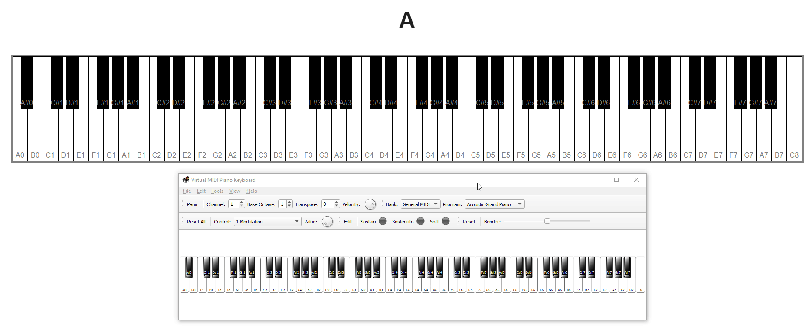
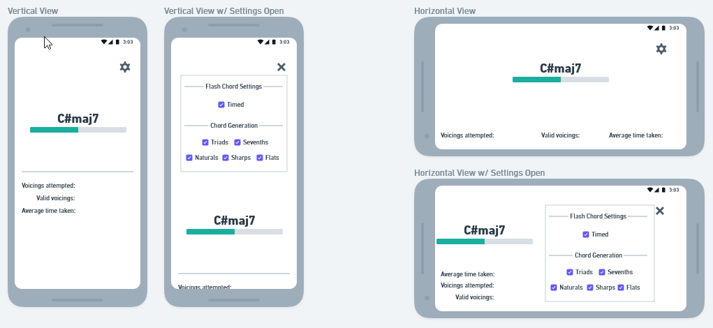
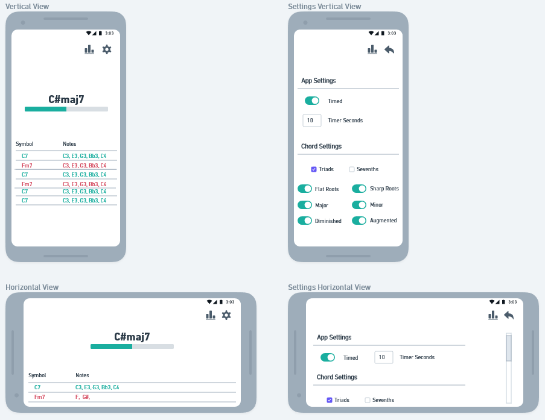
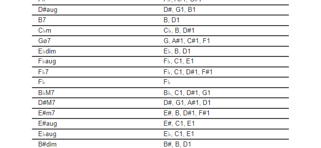
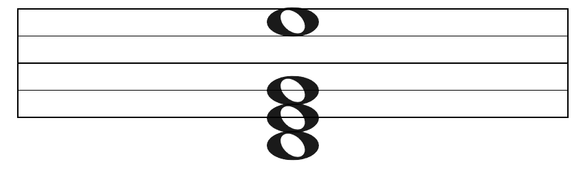
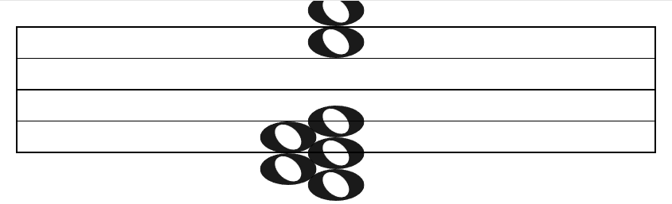
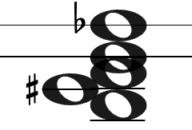
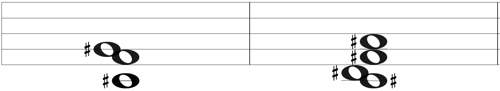
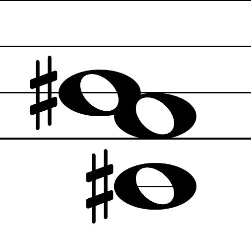

Chord Notation Practice
=====================
[](https://github.com/LukeDowell/chord-notation/actions/workflows/push.yml)

https://flashchords.app/



## Features

* Display chord notation, give feedback on whether or not it was input correctly
* Virtual keyboard
* MIDI input support
* Stats. Correct / Incorrect ratio, time taken to enter chord, keys that the user is most successful in, etc etc
* Chord display configuration: normie triads, inversions, 7ths + 9ths, key selection

## Notes

Web MIDI API spec - https://www.w3.org/TR/webmidi/
Firefox Implementation Tracker - https://bugzilla.mozilla.org/show_bug.cgi?id=836897

## Dev Journal

**1/8/2022**

I spent some time reading the MIDI spec and the MIDI api reference. Upon finding that firefox
does not yet support the MIDI api but that there are in-flight tickets to test compatibility as of
three (!!!) days ago, I almost distracted myself by seeing if I could pick Rust back up and contribute.
Instead, I switched to using chrome for local development. 

I got my repo all set up and set about getting a "hello world" for the MIDI api going. My first
hurdle was that my piano is about 20 feet away from my home computer, and I didn't want to run a giant
cable or work off my laptop and test with my physical piano. I needed to find a way to test locally
on my machine and emulate a piano connection. Something I had not considered was that this would be non-trivial;
a quote from the VPMK site: "To connect hardware MIDI devices you need physical MIDI cables. To connect MIDI software you need virtual cables." 
I tried a few different solutions but settled on using VMPK (Virtual Midi Piano Keyboard - https://vmpk.sourceforge.io/) and loopMIDI (https://www.tobias-erichsen.de/software/loopmidi.html).
Thank you Mr. Tobias Erichsen!

I fired up both pieces of software, configured VMPK to point to the port created by loopMIDI and voila, I could see a 
registered input in my console log of the MIDIAccess object returned by the MIDI api. 

**N+1**

My aim today is to explore the MIDI api now that my emulator is hooked up; what do notes / chords look like coming out 
of the piano. What would mapping a set of notes to a chord look like? I've also been thinking a little bit about the 
actual design of the "game" system itself; I think I am going to shoot for a pub / sub type of deal where components 
that care can register and receive notifications any time a music event is received. I hope this will let me write tests
without the emulator at all, and instead let me do things like "C2, E2, G2" received and map that to a C+ chord. It's 
tempting to look for some sort of package that can handle this mapping but I think I will learn more if I do it myself.

Alright after playing with the midi api type definitions, looks like it's all byte / int buffers coming out of the MIDI
events. I also learned that React renders at least twice by default in strict mode in an attempt to uncover issues, so I
am going to spend some time properly setting up all the hooks / update dependencies so that no longer happens since it's
causing the event listeners to the MIDI port to be added twice.

**1/10/2022**

I experimented with different styles of detecting what chords and notes are being played. I'm going
to try and have a "virtual" keyboard held in memory that updates based on the MIDI inputs, and any
components that care can just query that keyboard to see what is currently pressed. I think this will
make testing pretty convenient but there are lots of questions still to answer

**1/11/2022**

I presented the app idea to my teacher today. We ran through a bunch of examples of various chord
symbols and how they might be composed into small problems for a computer to solve. Given a chord
with a root note and a quality and a set of keys, can we determine if the keys are a valid voicing of the given chord?

Example:
Chord: C major
Keys: E2, G2, C3, E3

1. Remove duplicate notes 

        Keys: E2, G2, C3


2. Transpose any non-root notes to come after the lowest root note

       Keys: C3, E3, G3


4. Depending on the quality, calculate the required notes that should follow the root by interval
The quality is major, so we need a major third followed by a minor third, or 4 steps up the keyboard
followed by 3 steps.

       Required Keys: **C3** - C#3 - D3 - D#3 - **E3** - F3 - F#3 - **G3**

We have a match! This voicing is a valid representation of the Cmaj chord symbol. There are a lot
of edge cases to consider with more complicated versions of a chord symbol, for example something like 
"F -5/7 on C" (F major 7th flat five over C) but I'm gonna have future me figure that out.

**1/12/2022**

Reeee we have a bug! Sometimes the transposition of the active notes does not match the derived required
notes from the root. As an example, for F major:

      Active Keys: F5, A5, C6, F6

      Transposed and duplicated removed to match the octave of the lowest root note: F5, A5, **C5**

      Derived required notes: F5, A5, **C6**

For now, I am going to remove octave information all together and just compare the notes by themselves. This
wont last since in the future I would like a mode to enforce that the only way you cannot voice a chord symbol
is with the "standard" no-inversions or additions of a chord to hopefully influence the player to experiment.

**N+1**

During some reading about chord symbols, I found a wikipedia article that has a pretty interesting suggestion
for how to build out the Chord data structure. It suggests a chord is made of:

    1. the root note (e.g. C♯),
    2. the chord quality (e.g. minor or lowercase m, or the symbols o or + for diminished and augmented chords, respectively; chord quality is usually omitted for major chords),
    3. whether the chord is a triad, seventh chord, or an extended chord (e.g. Δ7),
    4. any altered notes (e.g. sharp five, or ♯5),
    5. any added tones (e.g. add2), and
    6. the bass note if it is not the root (e.g. a slash chord).

I have been wondering about how to deal with suspended chords or sevenths, but this seems like a fine framework
to go off of since it matches the domain anyway. DDD for the win!

**1/14/2022**

I got major and minor triads working just now. I was intending to continue on to getting 7ths to work
as well, but I think I'm going to pivot and get a rudimentary UI working. I want a bass
and treble cleff centered on the screen, and for the chord symbol to appear above it. The staff will
display the keys that the user is currently pressing, and there will be some sort of success indicator
once the user inputs the correct chord symbol. The staff should be a fun component to build, I'm looking
forward to that. 

**1/15/2022**

Today I bought a domain name and deployed the app to the web. My pipeline is:

Github actions builds the front and back end, places the built frontend code into the resources/static directory of
the backend Spring app, then creates a container image using buildpacks. This image is pushed to the digitalocean container
registry, which is then deployed on their app platform. SSL is automatically configured apparently which is super tight,
I thought I was going to have to run an nginx + let's encrypt node.

Next I have to create some form of notification if the user is running an unsupported browser since the application
basically does nothing without a MIDI connection. After that I'm going to plop in material UI and start building the UI
that I outlined above. I also just realized typing this that I can actually test this app for real, holy crap.
Aaaand R.I.P, it doesn't work. It has to be something with the requestMIDIAccess() call, but I thought it was 
supported in chrome and safari by default. I'm going to figure out how to access the console logs on an ipad 
and fix it.

Okay bad news, neither chrome nor safari on iOS support navigator.requestMIDIAccess. I read up on it a little
bit and the MIDI api is apparently pretty trash security-wise. There are MIDI commands that could theoretically
brick a hardware device, so the entire API has been removed or will not be implemented in a bunch of browsers.
Additionally, WedMIDI support on WebKit is labelled as "not considering". This is a good lesson in doing compatibility
research first, although I'm glad I have gotten this far anyway. I'm going to continue development since android mobile
and desktops are still supported, I just need to get an android tablet.

**N+1**

So I just sat down at the piano and plugged a laptop into it. I found out there are some oddities between a real
piano and my MIDI emulator version, which is to be expected. For example, my piano doesn't leverage the "NOTE_OFF"
flag in MIDI. Instead it just says the note is still playing at an intensity of 0, which if you ask me is a little
smart alec-y. 

I also found out that my voicing validator is bad and that some combos don't work, like E major. Added a test case,
and I will add several more as well. Just kidding I clearly need this app to be done, I was just wrong on what notes
were in E major. The work is validated!


**1/16/2022**

Whew super long day / late night, took a lot longer than I would have liked to get the pipeline working
and pushing to DO. The buildpack for native spring boot app is 25 minutes which seems insane, I posted in
the paketo slack asking some questions to see if I can cache anything to speed that up.

I brought in MUI and am going to start putting together the practice page MVP with the chord prompt and
staff. Maybe after that we finally hop over to Spring and start putting together some statistic / user
features.

**N+1**

Cruising along on MUI. Moved some stuff out of PracticePage into App, I figure there should be some
global context holder for something like physical hardware so that is what I'll do. I may even check out
the Context API react provides but I'm guessing I won't use it.

I ran into a question that I have had before, and that is "If I am using MUI already, do I commit and 
use their Grid system as well?" and I think the answer to that is heck no. I'm going to just use flex 
directly with the `styled` engine. The benefits that are listed in the documentation do not outweigh 
having my layout tied to a bunch of MUI components. It also makes the JSX super messy imo.

The plan right now is to center the chord notation, provide some basic stats on your "session" thus far,
add a notification if the user is running an unsupported browser, then hop over to Spring. 

Also, crap, "chord notation" is not the commonly used term. It's "chord symbol". x_x

**1/17/2022**

I read a little bit about the utility classes that come with TypeScript today. In particular, I am partial to Partial.
It let me do this:

```typescript
mockRequestMIDIAccess.mockImplementation((): Promise<Partial<WebMidi.MIDIAccess>> => {
      return Promise.resolve({
        inputs: new Map<string, WebMidi.MIDIInput>([])
      })
    })
```

If the Partial type wrapper is omitted, typescript gets upset because you haven't implemented all the 
required members of WebMidi.MIDIAccess (which in this case is pretty messy and would be displeasing to do)

The warnings for unsupported browsers / no midi devices are done. I should have some kind of retry for the
missing input devices since someone could just plug one in, but I'll do that later. For now I'm going to
throw some Cleff component together and call it a day.

Instead of a cleff I decided to go with a visual representation of the virtual keyboard. Along the way I 
settled on using the styled engine that material comes with. It seems to be based on the `styled-components`
library so leaving MUI shouldn't be too tough. I have the keyboard all laid out, I just need to find
some pleasing way to get the black keys positioned correctly.

**1/18/2022**

I'm having a weird problem. Only the first chord on the Practice page is being checked; after that,
no matter what chord displays, the only correct one will be the initial chord. At first I thought
it was some mistake of me closing over a variable or something but now I am not so sure. I added
some logs and I see that, after the first chord, it performs the voicing check twice. Once for
the original chord, and once for the new one. 

```
Checking voicing of D
Checking voicing of Caug
Checking voicing of D
Checking voicing of Ddim
Checking voicing of D
Checking voicing of Ddim
```

So then I thought that I was double registering active note listeners and that the first one
registered would close over the initial chord value, and since it would be checked first it would
always return true and move the app along. The issue persists, however, even when adding this code:

```typescript
  useEffect(() => {
    piano['listeners'] = []
    piano.addListener((activeNotes) => onActiveNotes(activeNotes))
  }, [currentChord])
```

I changed the listener field in the MIDI piano class to be a map, and updated the set function
to look like this:

```typescript
setListener(key: string, callback: (activeNotes: Note[]) => any) {
 this.listeners = new Map([
   ...this.listeners,
   [key, callback]
 ])
}
```

My issue was not resolved, I still like that change though since it allows me to avoid wiping out 
other listeners on accident. Now I'm wondering if maybe the entire component is rendering twice
from App or something, since my test case to cover this scenario is passing.

It does seem like there are two versions of the app, and one of them always holds on to the initial
chord / isn't updated. My suspicions now turn to the `useInterval` utility I found, I'm going to 
remove it and see if the issue persists.

That didn't change anything. What a pickle. I can set a breakpoint at the voicing check in PracticePage,
and see that `currentChord` evaluates to whatever the very first chord was, yet I can go inspect the
react component using dev tools and see that currentChord is some new, expected value. I must have 
some wild misconception about how closures / functions in TS work, I have been assuming that the 
`currentChord` value in the voicing check function will be reevaluated each time.

I have been rescued by a coworker (Thank you Michael!). The issue was that I was never cleaning up
the initial `onActiveNotes` callback provided to the MIDIPiano, so it closed over the first chord
value and never updated. The piano setup useEffect now looks like this:

```typescript
  useEffect(() => {
    const onActiveNotes = ...
    piano.setListener("PracticePage", onActiveNotes)

    return () => {
      piano.removeListener("PracticePage")
    }
  }, [currentChord])
```

I decided I am adding seventh support before moving to the backend, I want to actually use this app and
sevenths are gonna be required. I will also try and add some options to influence the generation of 
chords.

**1/20/2022**

I have been sloshing the chord data structure around in my head. The fact that a chord can be
a triad OR a seventh makes things hard, at least it seems to if I try and think of it that way.
The description of a chord from the wiki that I wrote about earlier is nice in an academic sense
but it is kind of grating against the code I already have. I came across a music theory video 
where they organized their description of sevenths by "added thirds", which would be layered on 
top of a diminished, minor, or major triad. I like thinking of it this way because it neatly fits 
into the array of semitones I currently base the validation code on. I can even handle the weird 
case of something trying to create an "augmented" seventh by adding a guard clause and just ignoring 
the 'extra' added third. 

I'm also just realizing that there is no reason a user shouldn't be able to use a flat note as a 
chord root, and I haven't accounted for that at all. Since it's a weird unicode symbol I think I
will have to make sure I add some button for it in any future "chord builder" components.

Ok just to make this refactor bigger and bigger, I'm also going to change the validator to accept
a chord with a root note of A-G and any accidental. I'll leave the keyboard as is, since those
"Notes" map to physical keys

Another thing to start noodling about is the fact that there will be a preferred way of naming the
notes of a chord, even if that results in not using the "standard" piano key layout. For example,
a C dominant 7th is C, E, G, and B♭. It makes sense to call it a B♭ instead of an A# because the 
seventh is a half step down, rather than being a half step up. I'll have to figure out some way of 
intelligently separating between the two. Perhaps by key is the simplest way.

Just found yet another uncovered case. The G#maj7 chord is composed of G#, B#, D# and F##. The F## is 
because it's actually a "normal" G, but it's a crime to have a sharp and natural version of a note on
the same cleff. I wonder if I can deal with this by writing my own note equality function, maybe any
note is equal as long it ends up on the same physical key. For example,

```typescript
{
  root: "G"
  accidental: {
    symbol: "#",
    mod: 1
  }
} as Note
```

will be equal to

```typescript
{
  root: "F"
  accidental: {
    symbol: "##",
    mod: 2
  }
} as Note
```

Question for teacher: is writing a G#maj7 as `"G#1", "C1", "D#2", "G2"` completely illegal? The "G2" obviously
is but what about the "C1"? should that be a B# instead?

How does my type system handle someone trying to create an augmented 7th?

**1/25/2022**

Took a bit of a break. Usually when I hit my initial MVP is when I place whatever project into the graveyard
of all my other abandoned projects, but I think this one is worth working on a bit more. I have some logos
and favicon options to use thanks to my girlfriend, honestly a little silly I waited this long to ask for 
them since everyone knows that is step 1 of starting any project.

I am gonna stick around the frontend a bit more. I am not sure why I felt the rush to get into that, 
perhaps just to validate the existence of the spring app and the fact I am paying to host a spring app
where I could just serve the static site for free, but oh well. I have almost no experience doing actual
mobile-first development so I'm going to try getting started on that. I'll be targeting android phones
and tablets since iOS unfortunately doesn't support Web MIDI. 

I'm curious what organizing this will be like. I know the idea is your base CSS is all for mobile, small
screen devices and you use media queries to scale up. I threw these together in Whimsical, and this will
be what I work towards for now.



I have no doubt that the settings design is a UX sin of the highest order, I'm gonna see how it 
feels first though.

**1/26/2022**

I need to wrap up the mvp mockup settings, but after that things will be looking pretty useful. I don't
think I am going to move to user based stuff quite yet, I am realizing I need to figure out what those
features look like in the mockup phase first.

It would be nice to start creating a feature that helps you memorize the circle of 5ths. Adding key signature
information will be interesting. A good data set of keys, their diatonic chords,
and maybe mode information? In my mind's eye I see a little circle of 5ths graphic making some sort of indicator
as you progress through the exercise. I want to pair visual learning with the flash card style. I'm lacking
feedback on the chord symbol practice itself as well, if the user fails a note we should at least tell them
what the correct notes would have been.

First though I'm going to add more settings around chord qualities, have the settings persist in the
browser, and better statistics views. Maybe we start going a little crazy with widgets as the browser
window scales up, we can put the keyboard back in!

**1/27/2022**

I finished up the settings and iterated on the mockups.



I'm pumped for the table tracking the previous set of chords. That's going to lead me into 
figuring out how best to represent the required notes for a given chord, IE A#2 vs Bb2 

Still thinking about what sort of stats would be most useful. I feel like there needs to be
a complimentary activity to the chord symbol practice activity in order to make stats interesting
/ useful. "What kinds of chords do I fail most?", "After practicing the diatonic chords of a given
key, how much more likely am I to successfully voice those chords?"

Something I might find useful at this point in my piano career is a diatonic chord activity. The user 
would be presented with some format of the circle of 5ths. They could choose a key, and then they
could play through the key a few different ways. 

* Triads or Sevenths
* Go through the scale in order, backwards, randomly
* Prompted on the roman numeral for the key

For feedback, I'd like to be able to show the user other visual information about the chord. Specifically,
the roman numeral, the symbol, and what the closed position chord looks like on a cleff. Maybe there can
be something where we "flip" the card, check the answer? Sounds kind of corny even writing it out.

**1/29/2022**

I was able to massively simplify the voicing validator today by basically just moving some code around and 
realizing I could delete a bunch. The transposition of the active notes into an ordered list was unnecessary.
In the future, if I want to create a mode that accepts anything except the most basic voicing of a chord,
then I'll need to do something like that again. For now, it's nice and simple to remove all the octave 
information from the comparator. 

I'm going to roll my own table for the voicing history stuff. I looked at some table components, in MUI and elsewhere,
and they are all huge overkill for what I need right now. I'm always a little grossed out by using the table
libraries, I know they are flexible and need to meet the use cases of a bunch of different domains, but ugh are they
gross to work with.

The app is coming along however it's still not quite useful enough for me to enjoy using it on my own. Soon, though. SOON.

Ha! Just ran into my first flat/sharp bug while putting the table together



A lot of the flat keys are wrong. In moving around some of the validation code I lost the "standardization"
from flats to sharps for the keyboard. It's a little sneaky because all code that relies on the validator
will still be fine, so all the chord generation / validation tests passed. This gets by because it only
fails when coming up with the required notes for a chord that has failed validation. 

I may just copy paste that validation code for now and noodle on how to solve this best. 

**1/30/2022**

Ah jeez something about the chord required notes code is borked. I get super weird results seemingly
randomly. I'm going to start adding a ton of diverse, manually validated chords as test cases all over.
I'm trying a sort of 'tiered' testing strategy where my core tests use the explicit data structures,
and then higher order tests use the convenience parser / toString code for chords and notes. I may 
regret it but I'm curious to see how it feels.

Activity idea: Arpegios based on interval, or patterns of different intervals. Move up and down a key alternating 
4ths and 5ths or something like that. I'd want to have a cleff display instead of any kind of symbol, and
it would be neat to auto generate the notes and have it scroll.

Still bug squashing today. I am going through the app and any time I see an invalid chord somewhere, either in a
different failing test or generated on the homepage, I'm manually checking it's notes and adding it to 
the test suite. The failures are wracking up but it has gotten pretty easy to add them with the 
dynamic tests.

**1/31/2022**

I'm running into some oddities around comparisons of objects with optional fields, particularly if that
optional field can be a number. I have a few tests failing with the output including stuff like this:

```
    Object {
      "accidental": Object {
        "mod": 1,
        "symbol": "#",
      },
-     "octave": undefined,
+     "octave": 1,
      "root": "G",
    },
```

Notes can have octave information or not, and if they have it, it's a number. A decent amount of my code doesn't
care about octave information so I omit it. This results in either it being undefined or 1, the default value 
for number. Using `toEqual(expected)` in jest isn't pruning these fields like I thought it would.

There is some issue with gathering the required notes for a chord after you let the page run for a bit. Initially
this bug was what caused me to go back and harden my test suite and refactor the voicing validator, however
it still persists. My next guess is that something is getting funky with the state of the component. 

The issue was with my random chord generator. I allowed for it to generate a chord with a quality of
undefined, which is not a valid chord at all. How to guard against that? Writing tests for generators
is kind of whack imo, at least doing something like 'generate 1,000 chords and make sure they are all ok'
feels weird.

**2/9/2022**

UX feedback from interview candidate; list of failed chords is not clear in purpose, she thought that 
they might have been chords the user has to to play before the timer runs out.

**4/1/2022**

Woo took a huge break, I started but didn't complete a different project in the meantime. I worked on this 
app for fun with a coworker and was inspired to try another feature: I'd like to have a scrolling staff 
to practice sight-reading with. 

**5/8/2022**

Break wasn't over! I fixed some chord related bugs and am moving on to adding some Keys. In my practice sessions we have
moved on to actually getting into jazz and diatonic chords have come to the forefront of my mind. Things that are swirling
around in my head now are some way of practicing keys in a fun way. What metrics would be interesting as a student? What 
exercise is best?

I also know that I'm going to need to be able to render a musical staff. I got some bare bones down, it's not exactly
pleasing to look at though...

```jsx
<StyledRoot>
    <BlackLine>
      <WholeNote />
    </BlackLine>
    <WhiteBar>
      <WholeNote />
    </WhiteBar>
    ...
```

The notes show up fine and there is something nice about each note on a given line being an actual JSX child, but my
current problems are overlapping notes and rendering notes "off staff" like middle C for a treble cleff. I looked at 
some example staffs and noticed that when notes are about to overlap, a note is "shifted" to the left ~50% of it's width
so that the edges of a note just meet.  

For rendering notes off staff, I don't think that will be too hard either. I'm wondering if the dash through a floating
note could just be some inline css...

**5/09/2022**

I've started adding key information, started with C major and started working my way around the circle and ran
into Fm7b5. I have just realized I haven't finished my chord implementation, and that my current structure doesn't 
fit very elegantly into it.

The quick and dirty way will be to just add "Half-Dimished" as a seventh quality type and then ignore whatever
value "quality" has on a given chord, but that feels kind of lame. I wonder if it would be better to build my
data structure around the idea of a first, third, fifth, seventh, and so on. Does that make it harder to calculate
semitones? It certainly seems to mirror the domain language better than just considering major/minor triad + some kind 
of seventh quality...the thing holding me back at the moment is that I anticipate it will be sort of annoying. 

I suppose I could think of it as having a diminished triad with a major seventh on top but, as far as I know, that
isn't how musicians would talk about a half diminished seventh.

Also, side thought, my test suite is getting sort of unwieldy. I started with parameterized tests that I simply add
to whenever I come across a bug. That strategy has worked alright, but I think my library is getting to the point where
I'd like to be able to assert across all diatonic sevenths for all keys, and perhaps all modes of those keys as well.


**5/16/2022**

I already handle half diminished chords *facepalm*

I switched from using '\u266d' all over the place to actually using '♭', we will see if I regret that. Perhaps
the greater sin is that in Keys.tsx I use the ♭ as part of a string key to retrieve information about the musical key.
I had to disable TWO inspections, surely I won't regret this later.

```typescript
'D♭': {
  notes: ['D♭', 'E♭', 'F', 'G♭', 'A♭', 'B♭', 'C'].map(toNote),
  quality: "major",
  diatonicChords: ['D♭maj7', 'E♭m7', 'Fm7', 'G♭maj7', 'A♭maj7', 'B♭m7', 'Cdim7'].map(symbolToChord)
},
```

**5/19/2022**

Lots of progress being made on the Measure component:



I was initially going to go through and lay it out line by line in the JSX but that felt pretty clumsy. In
particular I couldn't find a good way to apply the "left shift" to notes that overlapped, nor was it very scalable
when considering that sometimes notes go far beyond the staff vertically. 

I tried again with absolute positioning, and I think this will work well. All the data I need to make any choice
about how to render a given note is right there and accessible:

```typescript
 const noteComponents = notes.map((n, i) => {
    const key = `${noteToSymbol(n)}-note`.toLowerCase()
    const base = toNote(cleff === 'treble' ? 'F5' : 'A3')
    const interval = genericInterval(base, n)
    const top = `${(interval - 1) * (style.height / 8)}px`
    return <WholeNote data-testid={key} key={key}
                      scale={`${1.75 + (style.height / style.width)}`}
                      top={top}
    />
  })
```

It might be a little annoying getting the scale exactly right. I need the note to fully fill a white bar 
on the staff. Perhaps scale isn't the answer and I should just set the height / width directly...


Tada!



The code to successfully shift notes left doesn't actually totally make sense to me, I arrived at it via
some tinkering:

```typescript
 // Horizontally Position
 let left
 const neighbors: Note[] = notes.filter((maybeNeighbor) => genericInterval(maybeNeighbor, n) === 2)
   .filter((dn) => {
     // Remove neighbors who themselves have two neighbors so that we alternate notes if necessary
     const neighborsNeighbors = notes.filter((mn) => genericInterval(dn, mn) === 2)
     return neighborsNeighbors.length < 2
   })

 if (neighbors.length == 1) left = "42.5%"
```

The only remaining problem is the '42.5%'; I need to appropriately scale that value because if I adjust the height/width
of the measure at all it doesn't line up quite right anymore.


**5/21/2022**

First pass at accidentals complete;



Still have to add naturals, fix the improper staggering of the notes, and then properly implement scaling 
on the x-axis but the end is in sight. Once the measures render, I'll probably start trying to get some kind
of new game off the ground, like cycling through a key or something like that. I will also have to add it to the 
homepage I think, like an option to display the chord as you move through the main game.

**5/22/2022**

I was able to decomplect Measure's horizontal positioning by a good amount. The new code looks like this:

```typescript
let left = 50.0
if (leftShiftedNoteIndex.includes(i)) left = 42.5
else if (notes?.[i + 1] !== undefined && genericInterval(n, notes[i + 1]) === 2) {
   leftShiftedNoteIndex.push(i + 1)
} 
```

Each note checks to see if it's index is in the 'should be shifted pile'. If it's not, it 
checks to see if the note immediately above it needs to be shifted. This gives the nice effect
of never shifting the root of any cluster. This change also uncovered some bugs with the note sorting
code!

**5/23/2022**

I went to test out my measures and generate a series of chords for a given key. 

```typescript
const measures = MAJOR_KEYS['D♭'].diatonicChords.map(requiredNotesForChord)
 .map((notes) => layNotesOnKeyboard(notes, 4))
 .map((notes) => <Measure cleff={'treble'} notes={notes}/>)
```

and it looked like this!



An obvious problem is that the first chord only has three required notes, which is a bit odd for a seventh. 
The second is that none of the notes really match the key, there should be flats instead of sharps.
Time to begin on being able to transpose notes to a given key. I'm hoping there aren't too many weird 
bugs with this one...

**5/26/2022**

Ahh another bug, this time with the code that calculates which note is lowest. I based it off character code
which doesn't work, since a C is the lowest note in an octave and B is the highest. Shoot.

**5/27/2022**

Ok fixed that bug, notes from lowest->highest now sort correctly. Now I am actually on to key transposition. I feel like
this is gonna be sort of tricky to do in a satisfying way. Thus far I have "standardized" on the layout that the
keyboard seems to use, which is all sharps. Now when I am trying to render something like a D♭maj7, it looks like this:



The problem is that if the notes are calculated using the 'standardized' way, we end up with `C#, F, G# and C`. There is
an additional bug of me not correctly laying out the notes on the staff, so the C# and the C are both on octave 4 which
causes them to overlap and the C to 'disappear'. 

I'm wondering if there are going to be issues with B, C, E and F since you can "shift" physical keys depending on the 
accidental. 
