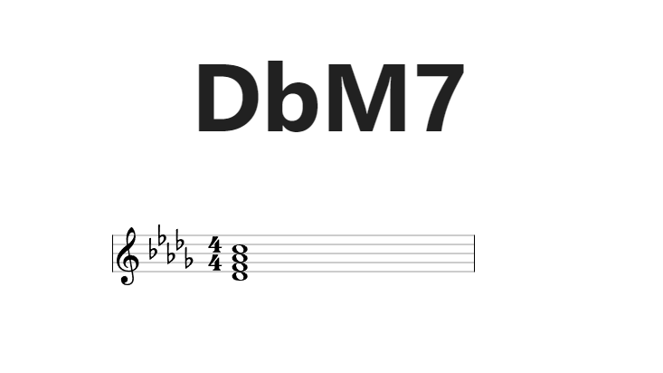
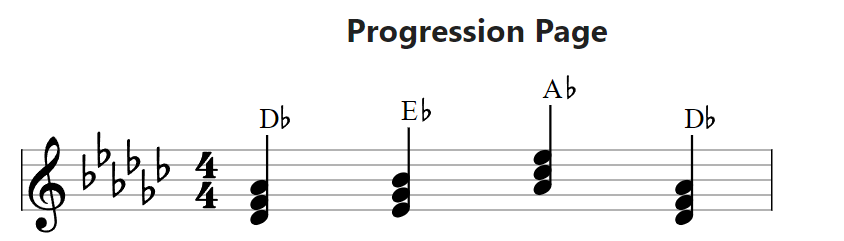
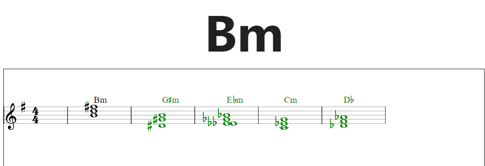
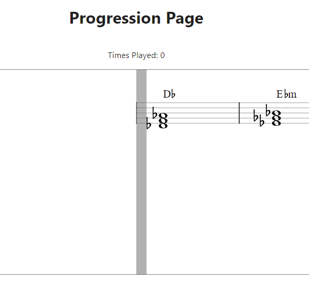
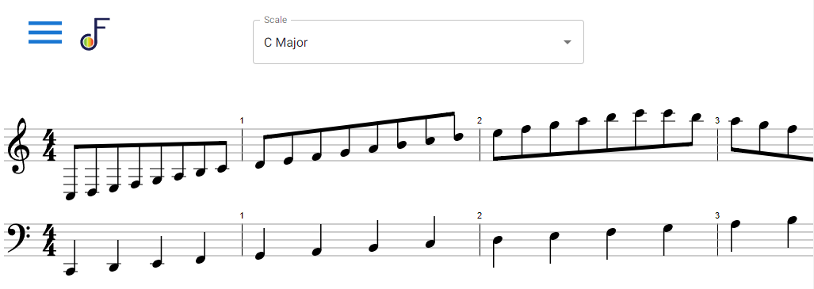

Flash Chords
=====================
[](https://github.com/LukeDowell/flash-chords/actions/workflows/test-and-build.yaml)

**Live Site - https://flashchords.app/**


## Dev Journal

## 01/8/2022

I spent some time reading the MIDI spec and the MIDI api reference. Upon finding that firefox
does not yet support the MIDI api but that there are in-flight tickets to test compatibility as of
three (!!!) days ago, I almost distracted myself by seeing if I could pick Rust back up and contribute.
Instead, I switched to using chrome for local development.

I got my repo all set up and set about getting a "hello world" for the MIDI api going. My first
hurdle was that my piano is about 20 feet away from my home computer, and I didn't want to run a giant
cable or work off my laptop and test with my physical piano. I needed to find a way to test locally
on my machine and emulate a piano connection. Something I had not considered was that this would be non-trivial;
a quote from the VPMK site: "To connect hardware MIDI devices you need physical MIDI cables. To connect MIDI software
you need virtual cables."
I tried a few different solutions but settled on using VMPK (Virtual Midi Piano Keyboard - https://vmpk.sourceforge.io/)
and loopMIDI (https://www.tobias-erichsen.de/software/loopmidi.html).
Thank you Mr. Tobias Erichsen!

I fired up both pieces of software, configured VMPK to point to the port created by loopMIDI and voila, I could see a
registered input in my console log of the MIDIAccess object returned by the MIDI api.

## 01/09/2022

My aim today is to explore the MIDI api now that my emulator is hooked up; what do notes / chords look like coming out
of the piano. What would mapping a set of notes to a chord look like? I've also been thinking a little bit about the
actual design of the "game" system itself; I think I am going to shoot for a pub / sub type of deal where components
that care can register and receive notifications any time a music event is received. I hope this will let me write tests
without the emulator at all, and instead let me do things like "C2, E2, G2" received and map that to a C+ chord. It's
tempting to look for some sort of package that can handle this mapping but I think I will learn more if I do it myself.

Alright after playing with the midi api type definitions, looks like it's all byte / int buffers coming out of the MIDI
events. I also learned that React renders at least twice by default in strict mode in an attempt to uncover issues, so I
am going to spend some time properly setting up all the hooks / update dependencies so that no longer happens since it's
causing the event listeners to the MIDI port to be added twice.

## 01/10/2022

I experimented with different styles of detecting what chords and notes are being played. I'm going
to try and have a "virtual" keyboard held in memory that updates based on the MIDI inputs, and any
components that care can just query that keyboard to see what is currently pressed. I think this will
make testing pretty convenient but there are lots of questions still to answer

## 01/11/2022

I presented the app idea to my teacher today. We ran through a bunch of examples of various chord
symbols and how they might be composed into small problems for a computer to solve. Given a chord
with a root note and a quality and a set of keys, can we determine if the keys are a valid voicing of the given chord?

Example:
Chord: C major
Keys: E2, G2, C3, E3

1. Remove duplicate notes

        Keys: E2, G2, C3


2. Transpose any non-root notes to come after the lowest root note

       Keys: C3, E3, G3

3. Depending on the quality, calculate the required notes that should follow the root by interval

The quality is major, so we need a major third followed by a minor third, or 4 steps up the keyboard
followed by 3 steps.

       Required Keys: **C3** - C#3 - D3 - D#3 - **E3** - F3 - F#3 - **G3**

We have a match! This voicing is a valid representation of the Cmaj chord symbol. There are a lot
of edge cases to consider with more complicated versions of a chord symbol, for example something like
"F -5/7 on C" (F major 7th flat five over C) but I'm gonna have future me figure that out.

## 01/12/2022

Reeee we have a bug! Sometimes the transposition of the active notes does not match the derived required
notes from the root. As an example, for F major:

      Active Keys: F5, A5, C6, F6

      Transposed and duplicated removed to match the octave of the lowest root note: F5, A5, **C5**

      Derived required notes: F5, A5, **C6**

For now, I am going to remove octave information all together and just compare the notes by themselves. This
wont last since in the future I would like a mode to enforce that the only way you cannot voice a chord symbol
is with the "standard" no-inversions or additions of a chord to hopefully influence the player to experiment.

## 01/13/2022

During some reading about chord symbols, I found a wikipedia article that has a pretty interesting suggestion
for how to build out the Chord data structure. It suggests a chord is made of:

    1. the root note (e.g. C♯),
    2. the chord quality (e.g. minor or lowercase m, or the symbols o or + for diminished and augmented chords, respectively; chord quality is usually omitted for major chords),
    3. whether the chord is a triad, seventh chord, or an extended chord (e.g. Δ7),
    4. any altered notes (e.g. sharp five, or ♯5),
    5. any added tones (e.g. add2), and
    6. the bass note if it is not the root (e.g. a slash chord).

I have been wondering about how to deal with suspended chords or sevenths, but this seems like a fine framework
to go off of since it matches the domain anyway. DDD for the win!

## 01/14/2022

I got major and minor triads working just now. I was intending to continue on to getting 7ths to work
as well, but I think I'm going to pivot and get a rudimentary UI working. I want a bass
and treble cleff centered on the screen, and for the chord symbol to appear above it. The staff will
display the keys that the user is currently pressing, and there will be some sort of success indicator
once the user inputs the correct chord symbol. The staff should be a fun component to build, I'm looking
forward to that.

## 01/15/2022

Today I bought a domain name and deployed the app to the web. My pipeline is:

Github actions builds the front and back end, places the built frontend code into the resources/static directory of
the backend Spring app, then creates a container image using buildpacks. This image is pushed to the digitalocean
container
registry, which is then deployed on their app platform. SSL is automatically configured apparently which is super tight,
I thought I was going to have to run an nginx + let's encrypt node.

Next I have to create some form of notification if the user is running an unsupported browser since the application
basically does nothing without a MIDI connection. After that I'm going to plop in material UI and start building the UI
that I outlined above. I also just realized typing this that I can actually test this app for real, holy crap.
Aaaand R.I.P, it doesn't work. It has to be something with the requestMIDIAccess() call, but I thought it was
supported in chrome and safari by default. I'm going to figure out how to access the console logs on an ipad
and fix it.

Okay bad news, neither chrome nor safari on iOS support navigator.requestMIDIAccess. I read up on it a little
bit and the MIDI api is apparently pretty trash security-wise. There are MIDI commands that could theoretically
brick a hardware device, so the entire API has been removed or will not be implemented in a bunch of browsers.
Additionally, WedMIDI support on WebKit is labelled as "not considering". This is a good lesson in doing compatibility
research first, although I'm glad I have gotten this far anyway. I'm going to continue development since android mobile
and desktops are still supported, I just need to get an android tablet.

## 01/15/2022

So I just sat down at the piano and plugged a laptop into it. I found out there are some oddities between a real
piano and my MIDI emulator version, which is to be expected. For example, my piano doesn't leverage the "NOTE_OFF"
flag in MIDI. Instead it just says the note is still playing at an intensity of 0, which if you ask me is a little
smart alec-y.

I also found out that my voicing validator is bad and that some combos don't work, like E major. Added a test case,
and I will add several more as well. Just kidding I clearly need this app to be done, I was just wrong on what notes
were in E major. The work is validated!

## 01/16/2022

Whew super long day / late night, took a lot longer than I would have liked to get the pipeline working
and pushing to DO. The buildpack for native spring boot app is 25 minutes which seems insane, I posted in
the paketo slack asking some questions to see if I can cache anything to speed that up.

I brought in MUI and am going to start putting together the practice page MVP with the chord prompt and
staff. Maybe after that we finally hop over to Spring and start putting together some statistic / user
features.

## 01/17/2022

Cruising along on MUI. Moved some stuff out of PracticePage into App, I figure there should be some
global context holder for something like physical hardware so that is what I'll do. I may even check out
the Context API react provides but I'm guessing I won't use it.

I ran into a question that I have had before, and that is "If I am using MUI already, do I commit and
use their Grid system as well?" and I think the answer to that is heck no. I'm going to just use flex
directly with the `styled` engine. The benefits that are listed in the documentation do not outweigh
having my layout tied to a bunch of MUI components. It also makes the JSX super messy imo.

The plan right now is to center the chord notation, provide some basic stats on your "session" thus far,
add a notification if the user is running an unsupported browser, then hop over to Spring.

Also, crap, "chord notation" is not the commonly used term. It's "chord symbol". x_x

## 01/17/2022

I read a little bit about the utility classes that come with TypeScript today. In particular, I am partial to Partial.
It let me do this:

```typescript
mockRequestMIDIAccess.mockImplementation((): Promise<Partial<WebMidi.MIDIAccess>> => {
      return Promise.resolve({
        inputs: new Map<string, WebMidi.MIDIInput>([])
      })
    })
```

If the Partial type wrapper is omitted, typescript gets upset because you haven't implemented all the
required members of WebMidi.MIDIAccess (which in this case is pretty messy and would be displeasing to do)

The warnings for unsupported browsers / no midi devices are done. I should have some kind of retry for the
missing input devices since someone could just plug one in, but I'll do that later. For now I'm going to
throw some Cleff component together and call it a day.

Instead of a cleff I decided to go with a visual representation of the virtual keyboard. Along the way I
settled on using the styled engine that material comes with. It seems to be based on the `styled-components`
library so leaving MUI shouldn't be too tough. I have the keyboard all laid out, I just need to find
some pleasing way to get the black keys positioned correctly.

## 1/18/2022

I'm having a weird problem. Only the first chord on the Practice page is being checked; after that,
no matter what chord displays, the only correct one will be the initial chord. At first I thought
it was some mistake of me closing over a variable or something but now I am not so sure. I added
some logs and I see that, after the first chord, it performs the voicing check twice. Once for
the original chord, and once for the new one.

```
Checking voicing of D
Checking voicing of Caug
Checking voicing of D
Checking voicing of Ddim
Checking voicing of D
Checking voicing of Ddim
```

So then I thought that I was double registering active note listeners and that the first one
registered would close over the initial chord value, and since it would be checked first it would
always return true and move the app along. The issue persists, however, even when adding this code:

```typescript
  useEffect(() => {
    piano['listeners'] = []
    piano.addListener((activeNotes) => onActiveNotes(activeNotes))
  }, [currentChord])
```

I changed the listener field in the MIDI piano class to be a map, and updated the set function
to look like this:

```typescript
setListener(key: string, callback: (activeNotes: Note[]) => any) {
 this.listeners = new Map([
   ...this.listeners,
   [key, callback]
 ])
}
```

My issue was not resolved, I still like that change though since it allows me to avoid wiping out
other listeners on accident. Now I'm wondering if maybe the entire component is rendering twice
from App or something, since my test case to cover this scenario is passing.

It does seem like there are two versions of the app, and one of them always holds on to the initial
chord / isn't updated. My suspicions now turn to the `useInterval` utility I found, I'm going to
remove it and see if the issue persists.

That didn't change anything. What a pickle. I can set a breakpoint at the voicing check in PracticePage,
and see that `currentChord` evaluates to whatever the very first chord was, yet I can go inspect the
react component using dev tools and see that currentChord is some new, expected value. I must have
some wild misconception about how closures / functions in TS work, I have been assuming that the
`currentChord` value in the voicing check function will be reevaluated each time.

I have been rescued by a coworker (Thank you Michael!). The issue was that I was never cleaning up
the initial `onActiveNotes` callback provided to the MIDIPiano, so it closed over the first chord
value and never updated. The piano setup useEffect now looks like this:

```typescript
  useEffect(() => {
    const onActiveNotes = ...
    piano.setListener("PracticePage", onActiveNotes)

    return () => {
      piano.removeListener("PracticePage")
    }
  }, [currentChord])
```

I decided I am adding seventh support before moving to the backend, I want to actually use this app and
sevenths are gonna be required. I will also try and add some options to influence the generation of
chords.

## 1/20/2022

I have been sloshing the chord data structure around in my head. The fact that a chord can be
a triad OR a seventh makes things hard, at least it seems to if I try and think of it that way.
The description of a chord from the wiki that I wrote about earlier is nice in an academic sense
but it is kind of grating against the code I already have. I came across a music theory video
where they organized their description of sevenths by "added thirds", which would be layered on
top of a diminished, minor, or major triad. I like thinking of it this way because it neatly fits
into the array of semitones I currently base the validation code on. I can even handle the weird
case of something trying to create an "augmented" seventh by adding a guard clause and just ignoring
the 'extra' added third.

I'm also just realizing that there is no reason a user shouldn't be able to use a flat note as a
chord root, and I haven't accounted for that at all. Since it's a weird unicode symbol I think I
will have to make sure I add some button for it in any future "chord builder" components.

Ok just to make this refactor bigger and bigger, I'm also going to change the validator to accept
a chord with a root note of A-G and any accidental. I'll leave the keyboard as is, since those
"Notes" map to physical keys

Another thing to start noodling about is the fact that there will be a preferred way of naming the
notes of a chord, even if that results in not using the "standard" piano key layout. For example,
a C dominant 7th is C, E, G, and B♭. It makes sense to call it a B♭ instead of an A# because the
seventh is a half step down, rather than being a half step up. I'll have to figure out some way of
intelligently separating between the two. Perhaps by key is the simplest way.

Just found yet another uncovered case. The G#maj7 chord is composed of G#, B#, D# and F##. The F## is
because it's actually a "normal" G, but it's a crime to have a sharp and natural version of a note on
the same cleff. I wonder if I can deal with this by writing my own note equality function, maybe any
note is equal as long it ends up on the same physical key. For example,

```typescript
{
  root: "G"
  accidental: {
    symbol: "#",
    mod: 1
  }
} as Note
```

will be equal to

```typescript
{
  root: "F"
  accidental: {
    symbol: "##",
    mod: 2
  }
} as Note
```

Question for teacher: is writing a G#maj7 as `"G#1", "C1", "D#2", "G2"` completely illegal? The "G2" obviously
is but what about the "C1"? should that be a B# instead?

How does my type system handle someone trying to create an augmented 7th?

## 1/25/2022

Took a bit of a break. Usually when I hit my initial MVP is when I place whatever project into the graveyard
of all my other abandoned projects, but I think this one is worth working on a bit more. I have some logos
and favicon options to use thanks to my girlfriend, honestly a little silly I waited this long to ask for
them since everyone knows that is step 1 of starting any project.

I am gonna stick around the frontend a bit more. I am not sure why I felt the rush to get into that,
perhaps just to validate the existence of the spring app and the fact I am paying to host a spring app
where I could just serve the static site for free, but oh well. I have almost no experience doing actual
mobile-first development so I'm going to try getting started on that. I'll be targeting android phones
and tablets since iOS unfortunately doesn't support Web MIDI.

I'm curious what organizing this will be like. I know the idea is your base CSS is all for mobile, small
screen devices and you use media queries to scale up. I threw these together in Whimsical, and this will
be what I work towards for now.


I have no doubt that the settings design is a UX sin of the highest order, I'm gonna see how it
feels first though.

## 1/26/2022

I need to wrap up the mvp mockup settings, but after that things will be looking pretty useful. I don't
think I am going to move to user based stuff quite yet, I am realizing I need to figure out what those
features look like in the mockup phase first.

It would be nice to start creating a feature that helps you memorize the circle of 5ths. Adding key signature
information will be interesting. A good data set of keys, their diatonic chords,
and maybe mode information? In my mind's eye I see a little circle of 5ths graphic making some sort of indicator
as you progress through the exercise. I want to pair visual learning with the flash card style. I'm lacking
feedback on the chord symbol practice itself as well, if the user fails a note we should at least tell them
what the correct notes would have been.

First though I'm going to add more settings around chord qualities, have the settings persist in the
browser, and better statistics views. Maybe we start going a little crazy with widgets as the browser
window scales up, we can put the keyboard back in!

## 1/27/2022

I finished up the settings and iterated on the mockups.


I'm pumped for the table tracking the previous set of chords. That's going to lead me into
figuring out how best to represent the required notes for a given chord, IE A#2 vs Bb2

Still thinking about what sort of stats would be most useful. I feel like there needs to be
a complimentary activity to the chord symbol practice activity in order to make stats interesting
/ useful. "What kinds of chords do I fail most?", "After practicing the diatonic chords of a given
key, how much more likely am I to successfully voice those chords?"

Something I might find useful at this point in my piano career is a diatonic chord activity. The user
would be presented with some format of the circle of 5ths. They could choose a key, and then they
could play through the key a few different ways.

* Triads or Sevenths
* Go through the scale in order, backwards, randomly
* Prompted on the roman numeral for the key

For feedback, I'd like to be able to show the user other visual information about the chord. Specifically,
the roman numeral, the symbol, and what the closed position chord looks like on a cleff. Maybe there can
be something where we "flip" the card, check the answer? Sounds kind of corny even writing it out.

## 1/29/2022

I was able to massively simplify the voicing validator today by basically just moving some code around and
realizing I could delete a bunch. The transposition of the active notes into an ordered list was unnecessary.
In the future, if I want to create a mode that accepts anything except the most basic voicing of a chord,
then I'll need to do something like that again. For now, it's nice and simple to remove all the octave
information from the comparator.

I'm going to roll my own table for the voicing history stuff. I looked at some table components, in MUI and elsewhere,
and they are all huge overkill for what I need right now. I'm always a little grossed out by using the table
libraries, I know they are flexible and need to meet the use cases of a bunch of different domains, but ugh are they
gross to work with.

The app is coming along however it's still not quite useful enough for me to enjoy using it on my own. Soon, though.
SOON.

Ha! Just ran into my first flat/sharp bug while putting the table together


A lot of the flat keys are wrong. In moving around some of the validation code I lost the "standardization"
from flats to sharps for the keyboard. It's a little sneaky because all code that relies on the validator
will still be fine, so all the chord generation / validation tests passed. This gets by because it only
fails when coming up with the required notes for a chord that has failed validation.

I may just copy paste that validation code for now and noodle on how to solve this best.

## 1/30/2022

Ah jeez something about the chord required notes code is borked. I get super weird results seemingly
randomly. I'm going to start adding a ton of diverse, manually validated chords as test cases all over.
I'm trying a sort of 'tiered' testing strategy where my core tests use the explicit data structures,
and then higher order tests use the convenience parser / toString code for chords and notes. I may
regret it but I'm curious to see how it feels.

Activity idea: Arpegios based on interval, or patterns of different intervals. Move up and down a key alternating
4ths and 5ths or something like that. I'd want to have a cleff display instead of any kind of symbol, and
it would be neat to auto generate the notes and have it scroll.

Still bug squashing today. I am going through the app and any time I see an invalid chord somewhere, either in a
different failing test or generated on the homepage, I'm manually checking it's notes and adding it to
the test suite. The failures are wracking up but it has gotten pretty easy to add them with the
dynamic tests.

## 1/31/2022

I'm running into some oddities around comparisons of objects with optional fields, particularly if that
optional field can be a number. I have a few tests failing with the output including stuff like this:

```
    Object {
      "accidental": Object {
        "mod": 1,
        "symbol": "#",
      },
-     "octave": undefined,
+     "octave": 1,
      "root": "G",
    },
```

Notes can have octave information or not, and if they have it, it's a number. A decent amount of my code doesn't
care about octave information so I omit it. This results in either it being undefined or 1, the default value
for number. Using `toEqual(expected)` in jest isn't pruning these fields like I thought it would.

There is some issue with gathering the required notes for a chord after you let the page run for a bit. Initially
this bug was what caused me to go back and harden my test suite and refactor the voicing validator, however
it still persists. My next guess is that something is getting funky with the state of the component.

The issue was with my random chord generator. I allowed for it to generate a chord with a quality of
undefined, which is not a valid chord at all. How to guard against that? Writing tests for generators
is kind of whack imo, at least doing something like 'generate 1,000 chords and make sure they are all ok'
feels weird.

## 2/9/2022

UX feedback from interview candidate; list of failed chords is not clear in purpose, she thought that
they might have been chords the user has to to play before the timer runs out.

## 4/1/2022

Woo took a huge break, I started but didn't complete a different project in the meantime. I worked on this
app for fun with a coworker and was inspired to try another feature: I'd like to have a scrolling staff
to practice sight-reading with.

## 5/8/2022

Break wasn't over! I fixed some chord related bugs and am moving on to adding some Keys. In my practice sessions we have
moved on to actually getting into jazz and diatonic chords have come to the forefront of my mind. Things that are
swirling
around in my head now are some way of practicing keys in a fun way. What metrics would be interesting as a student? What
exercise is best?

I also know that I'm going to need to be able to render a musical staff. I got some bare bones down, it's not exactly
pleasing to look at though...

```jsx
<StyledRoot>
    <BlackLine>
      <WholeNote />
    </BlackLine>
    <WhiteBar>
      <WholeNote />
    </WhiteBar>
    ...
```

The notes show up fine and there is something nice about each note on a given line being an actual JSX child, but my
current problems are overlapping notes and rendering notes "off staff" like middle C for a treble cleff. I looked at
some example staffs and noticed that when notes are about to overlap, a note is "shifted" to the left ~50% of it's width
so that the edges of a note just meet.

For rendering notes off staff, I don't think that will be too hard either. I'm wondering if the dash through a floating
note could just be some inline css...

## 5/09/2022

I've started adding key information, started with C major and started working my way around the circle and ran
into Fm7b5. I have just realized I haven't finished my chord implementation, and that my current structure doesn't
fit very elegantly into it.

The quick and dirty way will be to just add "Half-Diminished" as a seventh quality type and then ignore whatever
value "quality" has on a given chord, but that feels kind of lame. I wonder if it would be better to build my
data structure around the idea of a first, third, fifth, seventh, and so on. Does that make it harder to calculate
semitones? It certainly seems to mirror the domain language better than just considering major/minor triad + some kind
of seventh quality...the thing holding me back at the moment is that I anticipate it will be sort of annoying.

I suppose I could think of it as having a diminished triad with a major seventh on top but, as far as I know, that
isn't how musicians would talk about a half diminished seventh.

Also, side thought, my test suite is getting sort of unwieldy. I started with parameterized tests that I simply add
to whenever I come across a bug. That strategy has worked alright, but I think my library is getting to the point where
I'd like to be able to assert across all diatonic sevenths for all keys, and perhaps all modes of those keys as well.

## 5/16/2022

I already handle half diminished chords *facepalm*

I switched from using '\u266d' all over the place to actually using '♭', we will see if I regret that. Perhaps
the greater sin is that in Keys.tsx I use the ♭ as part of a string key to retrieve information about the musical key.
I had to disable TWO inspections, surely I won't regret this later.

```typescript
'D♭': {
  notes: ['D♭', 'E♭', 'F', 'G♭', 'A♭', 'B♭', 'C'].map(toNote),
  quality: "major",
  diatonicChords: ['D♭maj7', 'E♭m7', 'Fm7', 'G♭maj7', 'A♭maj7', 'B♭m7', 'Cdim7'].map(symbolToChord)
},
```

## 5/19/2022

Lots of progress being made on the Measure component:


I was initially going to go through and lay it out line by line in the JSX but that felt pretty clumsy. In
particular I couldn't find a good way to apply the "left shift" to notes that overlapped, nor was it very scalable
when considering that sometimes notes go far beyond the staff vertically.

I tried again with absolute positioning, and I think this will work well. All the data I need to make any choice
about how to render a given note is right there and accessible:

```typescript
 const noteComponents = notes.map((n, i) => {
    const key = `${noteToSymbol(n)}-note`.toLowerCase()
    const base = toNote(cleff === 'treble' ? 'F5' : 'A3')
    const interval = genericInterval(base, n)
    const top = `${(interval - 1) * (style.height / 8)}px`
    return <WholeNote data-testid={key} key={key}
                      scale={`${1.75 + (style.height / style.width)}`}
                      top={top}
    />
  })
```

It might be a little annoying getting the scale exactly right. I need the note to fully fill a white bar
on the staff. Perhaps scale isn't the answer and I should just set the height / width directly...

Tada!


The code to successfully shift notes left doesn't actually totally make sense to me, I arrived at it via
some tinkering:

```typescript
 // Horizontally Position
 let left
 const neighbors: Note[] = notes.filter((maybeNeighbor) => genericInterval(maybeNeighbor, n) === 2)
   .filter((dn) => {
     // Remove neighbors who themselves have two neighbors so that we alternate notes if necessary
     const neighborsNeighbors = notes.filter((mn) => genericInterval(dn, mn) === 2)
     return neighborsNeighbors.length < 2
   })

 if (neighbors.length == 1) left = "42.5%"
```

The only remaining problem is the '42.5%'; I need to appropriately scale that value because if I adjust the height/width
of the measure at all it doesn't line up quite right anymore.

## 5/21/2022

First pass at accidentals complete;


Still have to add naturals, fix the improper staggering of the notes, and then properly implement scaling
on the x-axis but the end is in sight. Once the measures render, I'll probably start trying to get some kind
of new game off the ground, like cycling through a key or something like that. I will also have to add it to the
homepage I think, like an option to display the chord as you move through the main game.

## 5/22/2022

I was able to decomplect Measure's horizontal positioning by a good amount. The new code looks like this:

```typescript
let left = 50.0
if (leftShiftedNoteIndex.includes(i)) left = 42.5
else if (notes?.[i + 1] !== undefined && genericInterval(n, notes[i + 1]) === 2) {
   leftShiftedNoteIndex.push(i + 1)
} 
```

Each note checks to see if it's index is in the 'should be shifted pile'. If it's not, it
checks to see if the note immediately above it needs to be shifted. This gives the nice effect
of never shifting the root of any cluster. This change also uncovered some bugs with the note sorting
code!

## 5/23/2022

I went to test out my measures and generate a series of chords for a given key.

```typescript
const measures = MAJOR_KEYS['D♭'].diatonicChords.map(requiredNotesForChord)
  .map((notes) => layNotesOnKeyboard(notes, 4))
  .map((notes) => <Measure cleff = {'treble'}
notes = {notes}
/>)
```

and it looked like this!


An obvious problem is that the first chord only has three required notes, which is a bit odd for a seventh.
The second is that none of the notes really match the key, there should be flats instead of sharps.
Time to begin on being able to transpose notes to a given key. I'm hoping there aren't too many weird
bugs with this one...

## 5/26/2022

Ahh another bug, this time with the code that calculates which note is lowest. I based it off character code
which doesn't work, since a C is the lowest note in an octave and B is the highest. Shoot.

## 5/27/2022

Ok fixed that bug, notes from lowest->highest now sort correctly. Now I am actually on to key transposition. I feel like
this is gonna be sort of tricky to do in a satisfying way. Thus far I have "standardized" on the layout that the
keyboard seems to use, which is all sharps. Now when I am trying to render something like a D♭maj7, it looks like this:


The problem is that if the notes are calculated using the 'standardized' way, we end up with `C#, F, G# and C`. There is
an additional bug of me not correctly laying out the notes on the staff, so the C# and the C are both on octave 4 which
causes them to overlap and the C to 'disappear'.

I'm wondering if there are going to be issues with B, C, E and F since you can "shift" physical keys depending on the
accidental.

## 06/07/2022

Absolutely TMI for a dev journal, but today I started using Vyvanse, I've read that the best way to see if it is working
is to write down how you're feeling and when you started it. Well, this will be that marker I suppose. Perhaps I'll be
all done and customer ready by the end of the month :)

For now, I am continuing to work on what I have previously called "transposition". I realized after watching a bunch
of theory videos that isn't what I'm doing, as far as I can tell anyway. Transposition would require a "source" key, and
the notes could move significantly on the staff. What I am doing is really formatting notes to make sense under a given
key, almost like "key aware formatting" or something like that. My mind is starting to wander towards building in the
idea of exercises or katas to be able to perform each day. To really nail that down I think I'd have to do a significant
amount of work on the Measure component to be able to handle all the lengths of different notes in addition to some
work on the MIDIPiano implementation itself.

Fun to think about, although I'd prefer to get started on users, logins and dashboards. If I am going to try and
monetize this
somehow, I absolutely need to have a useful and fun free tier. Right now I think my monetization strategy would come in
the form of teacher-centric tools, like seeing student progress and giving them assignments.

## 06/15/2022

While pairing on this project today I came across a very odd issue; I have multiple paramterized tests in several
describe blocks
in the music theory package. Occasionally tests will "leak" across when I am trying to run a specific test suite, and I
believe it happens because of similar naming. The test name template of several sets of parameterized tests is the same,
for example:

```typescript
    [["G3", "A#3", "D4", "F4"], "Gm7"],
  [["G3", "B♭3", "D4", "F4"], "Gm7"],
])
(
  '%s should be a valid voicing of %s',
```

and

```typescript
[["G#1", "C1", "D#2", "G2"], {root: "G", accidental: SHARP, quality: "Major", seventh: "Major"} as Chord],
  [["A#1", "C#1", "F1", "G#1"], {root: "B", accidental: FLAT, quality: "Minor", seventh: "Minor"} as Chord]
])
(
  '%s should be a valid voicing of %s',
```

In other news, formatting on a key is working! "Laying out" the notes on top of the root of a chord isn't working quite
perfectly, For Dbmaj7 the C ends up on the bottom, but the notes themselves are correct which is exciting stuff.

## 06/16/2022

Alright I'm sick of it, ♭ is gonna be 'b'

I've had a vision of a feature that I'd like to try and build. I think it would be interesting to try and create a
staff editor in-app that allows the user to place notes on the staff in some kind of ergonomic way. It's hard to imagine
what that actually looks like, and may end up lending itself to be rendered via Phaser or something like that, but I do
know that I'll have to crate a musical staff that accepts arbitrary notes.

The next iteration of the `Measure` is being able to have multiple sets of notes on it. I've been thinking of the idea
of 'beats', i.e putting a time signature into a data structure that wraps all the notes we need to render. Whatever the
index of the 'beat' is would dictate how far we place the note horizontally in the measure.

There are some weird notes that are going to be challenging to render:

- Grace notes
- When notes connect from the bass cleff into the treble cleff on a long arpeggio or something like that
- Connecting / intelligently rendering the connectors of eight notes / sixteenth notes / etc

Once all that is complete, we can move towards actually implementing users and having them persist the sheets they edit.
Being able to create different "games" would be very interesting, like what sorts of requirements can the creator attach
to their sheet?

- Playing at speed?
- Play x times accurately playing y% of notes?
- Specific voicings:
    - 3rd and 5th shells
    - playing anything other than the most basic root voicing?
    - spanning more than an octave?
    - Avoid chords with x quality?

It's easy then to think of there being a free, community collection of challenges. Maybe teachers could create their own
curriculums and track their students' progress. Highscores among your friends / class?

I can see having to refactor the piano/activeNotes related code in the future as well. I wonder what an event-log of
keys
would be like? If I'm going to support arpeggios in the future I'll need to be able to see a history of notes. Maybe we
could have an array of the last 200 notes played or something like that, and "activeNotes" would just be reading '
key-down'
events for the last x notes until we encountered a 'key-up' event

## 9/10/2022

Whew long break. I read a post on hackernews a few weeks ago and some person was talking about how the secret to working
on side projects is to only work on them when you feel like it, and I seem to be taking that to heart. When I stopped I
was in the middle of making a staff component to presumably render a bunch of notes but I am

## 9/12/2022

Didn't even finish that last entry, wild. I do miss being in the habit of working on this, I took a detour and checked
out some python + opencv stuff which was neat, but I don't think it has motivational-legs and thus I am going to return
to this project. I just finished my very first piano recital this last weekend, I played a rendition of Merry-Go-Round
of
Life by Joe Hisaishi. I was so nervous that my hands were shaking! I did okay though, definitely a few mistakes and
awkward
pauses, but I'm still satisfied with how it went.

I have refactored the way keys + diatonic chords work, I am not totally on-board with how it currently is because I
think
it's not going to work as well once I try and add extended chords, but for now I'm gonna let it sit. This is basically
it:

```typescript
const DIATONIC_QUALITIES: Record<KeyQuality, string[]> = {
  'Major': ['maj7', 'm7', 'm7', 'maj7', '7', 'm7', 'm7b5'],
  'Natural Minor': ['m7', 'm7b5', 'maj7', 'm7', 'm7', 'maj7', '7'],
  'Harmonic Minor': ['m7', 'm7b5', 'mM7', 'm7', '7', 'maj7', 'o7'],
  'Melodic Minor': ['mM7', 'm7', 'augM7', '7', '7', 'm7b5', 'm7b5'],
}

export const getDiatonicChords = (notes: Note[], quality: KeyQuality = "Major"): Chord[] => {
  if (notes.length !== 7) throw new Error('Provided note array must have length of 7')
  const noteSymbols = notes.map((n) => new Note(n.root, n.accidental, undefined)).map(noteToSymbol)
  const [first, second, third, fourth, fifth, sixth, seventh] = noteSymbols
  return [
    first.concat(DIATONIC_QUALITIES[quality][0]),
    second.concat(DIATONIC_QUALITIES[quality][1]),
    third.concat(DIATONIC_QUALITIES[quality][2]),
    fourth.concat(DIATONIC_QUALITIES[quality][3]),
    fifth.concat(DIATONIC_QUALITIES[quality][4]),
    sixth.concat(DIATONIC_QUALITIES[quality][5]),
    seventh.concat(DIATONIC_QUALITIES[quality][6]),
  ].map(toChord)
}

export const MAJOR_KEYS: Record<string, Key> = {
  'Cb': new Key(['Cb', 'Db', 'Eb', 'Fb', 'Gb', 'Ab', 'Bb'].map(toNote), "Major"),
  'Gb': new Key(['Gb', 'Ab', 'Bb', 'Cb', 'Db', 'Eb', 'F'].map(toNote), "Major"),
// ...etc
```

Something that is starting to bug me a bit is how this app is oriented around seventh chords programmatically. Reducing
the complexity of the chord is fine since it's basically just chopping off a section of a chord, but what about all
the different ways chords come together beyond a root voicing? I feel like a refactor is coming where, instead, I'd like
the code to think of chords as an assemblage of scale degrees + modifiers. ({1, 3, b5, 7} for example)

This is definitely due to me furthering my understanding of music theory over these last 8 (!!!) months, which is a good
thing!

I'm going to chew on that idea though and press onwards. Refactors have not been too painful thus far, so I am not
worried.
In the immediate future, I am going to try and get out some improvements to the main practice app. Specifically I want
to be able to select a key and restrict all generated chords to ones that "belong" in that key.

I'm trying to figure out how to find an appropriate key for chords where it's not immediately obvious. I tried just
pulling out a key based on the quality and root note of a given chord:

```typescript
const keyForChord = (c: Chord): Key => {
  const keyString = `${c.root}${c.accidental?.symbol || ""}`;
  const key = c.quality === "Minor" ? MINOR_KEYS[keyString] : MAJOR_KEYS[keyString]
  return key
}
```

but that doesn't work well, because there are more roots + qualities than there are keys. Where does something
like `B#dim`
fit in? Bit of an odd chord, and maybe the answer is that it just doesn't, but we will see what can be discovered.

## 09/20/2022

I've run into a snag with the formatting of each chord. My initial pass looks like this:

```typescript
export const formattedNotesForChord = (c: Chord): Note[] => {
  const chordRoot = new Note(c.root, c.accidental)
  const normalizedNotes = requiredNotesForChord(c)
  const validKeys = KEYS.filter((key) => {
    const chordNotesInKey = formatNotesInKey(normalizedNotes, key)
    const chordNotesAsString = chordNotesInKey.map(n => n.toString()).join()
    const chordNotesOnlyRoots = chordNotesInKey.map(n => n.root)
    const hopefullyUniqueRoots = [...new Set(chordNotesOnlyRoots)]
    const keyHasAllNotes = chordNotesInKey.every(n => key.notes.some(kn => n.equalsWithoutOctave(kn)))

    if (!chordNotesInKey.some(n => chordRoot.equalsWithoutOctave(n))) return false
    else if (chordNotesAsString.includes('#') && chordNotesAsString.includes('b')) return false
    else if (hopefullyUniqueRoots.length !== chordNotesOnlyRoots.length) return false
    else if (chordNotesInKey.some(n => n.accidental?.symbol === NATURAL.symbol)) return false
    else if (!keyHasAllNotes) return false

    return true
  })

  if (validKeys.length === 0) {
    throw new Error(`No valid keys found for chord ${toSymbol(c)}`)
  }

  return formatNotesInKey(normalizedNotes, validKeys[0])
}
```

This is all fine and dandy until you get to a 'weird' chord, my classic choice being `B#dim`. I had to try and add
naturals
to the `formatNotesInKey` function to support this feature and I'm thinking I didn't do it quite right. When testing on
`B#dim` in the key of `C# major`, I end up getting the notes of `Cnatural, D# and F#`. This is because my "
normalization"
code is divorced from the code that then translates those normalized notes into a key-aware context, and thus doesn't
know how to handle things like B#. I'm guessing it's a safe bet to assume that Fb will provide similar issues.

Maybe the solution is treat B# and Fb as normal values for a normalized keyboard? It doesn't sound great when I type it
out, especially since with the Fb it breaks the promise that all naturalized notes can only be sharps.

Ah crap, in my debugging of this particular problem, I discovered that keys CAN have mixed accidentals. I'm not sure if
this will actually break anything, I just know I have made that assumption even prior to writing the above block of
code.

Double crap, also just came across my first double sharp. These minor keys get weird. Kind of seems tangentially related
to my current issue actually
since I really doubt that the addition of double sharp will matter too much. How can I calculate whether or not a note
is symantically similar to another note? In the `B#dim` case, B# is going to be semantically similar to C, and if that
is
the case, I should leave it alone.

## 09/21/2022

Well, it's very late, but I believe I am 95% of the way done with human readable chord formatting. Wow! That was way
harder
than I thought it would be, although I suspect that some difficulty is coming from myself. I did have one crash while
testing before I added some extra logging and I suspect that the input chord was a `A#augM7` which is sort of intense
as far as chords go. Tomorrow I'll clean up what I wrote today, and then I will try and get key-specific chord
generation
going before my lesson!

## 01/30/2023

I got a new job recently and a coworker mentioned Chris Ford's Functional Composition talk in passing. I have since
watched
it twice and believe it to be my favorite technical talk so far. I was reminded of this app, and how it's hit a bit of a
stopping point. Having unfinished side projects is a bit of a meme in the software community, but I think in this
particular
case it is for a few reasons:

* My abstractions in the music theory library have accuracy issues
* My abstractions in the music theory library are not what I would choose if I were to do it over, but the thought of
  completely starting over doesn't sound fun.
* I wasn't generating features that I personally found useful fast enough.

Most important issue was probably the last one. IRL my piano goal for this year is to be able to pretty much arbitrarily
play any song from the real book in it's basic form. The way I try and practice on my own w/ a metronome is by playing
various chord progressions in simple form from a set of 'random' keys. I think the minimum feature set I'd like to have
from my app for me to prefer doing it on the app would be:

* Rendering the chord progression w/ the chord symbol above the staff. This means in the correct key with appropriate
  accidentals.
* Tracking progression / days I have done my exercises
* Some kind of threshold I have to hit to 'complete' the exercise, ex. 4 times flawlessly at 90bpm
* Some form of error correction. Show me where I made a mistake, if not the exact mistake itself

So, perhaps in direct opposition to my stated problem and goal, I'm going to migrate this project over to NextJS. I do
not need the Spring backend for this project and the buildpack for Spring takes ~20 minutes or so, it's just overkill
for serving an app like this. I have been using NextJS for work and have been enjoying it. I do not expect that to take
a long time. After that I'm going to start pulling in and tinkering with some libraries found
on [this list](https://github.com/ciconia/awesome-music)
I'm probably going to use VexFlow for rendering the Staff and perhaps Midi.js as well, although it doesn't look like
it takes any input, just output. A pre-concern I have for vexflow is that the rendering will take too long to provide
instant feedback while playing, if the staff has to "disappear" to re-render that's going to be a no-go. If that is the
case that is fine, I don't think that finishing a basic version of the staff will take too long, I just don't want
to lose motivation while fiddling with annoying CSS bits.

The TODO list is as follows:

1. Migrate the repository to NextJS
2. Create a POC with VexFlow to see if it's a viable staff rendering solution
3. Begin work on the chord progression feature page

*Part 2*

Ok so I'm mostly transitioned over to NextJS. I am, however, getting a nasty hydration error!

```
Unhandled Runtime Error
Error: Text content does not match server-rendered HTML.

See more info here: https://nextjs.org/docs/messages/react-hydration-error
```

This was spooky at first, but the more I read about it the more it completely makes sense. NextJS is trying to render
everything server-side by default, and Flash Chords never had to worry about that even being possible in the previous
structure. I suspect that my current issue is because I am rendering practice page content that only appears if you have
a valid MIDI device, which of course the server will not.

If I had just opened the console up, I'd have saved myself quite a bit of time! Here is the message it spits out:
`Warning: Text content did not match. Server: "Em7" Client: "AM7"`

Related to the above paragraph, this is the constructor for the current PracticePage component:

```typescript
export default function PracticePage({
                                       piano,
                                       initialChord = generateRandomChord(),
// ...
```

The default parameter must be called both times and obviously end up with a different result each time! To fix this,
I'm just going to add the initial chord parameter to the parent page and pass it in. I'm not a huge fan of that solution
though, I'm wondering if there is a way that makes more sense...

Nothing immediately comes to mind. I suppose this won't really bug me once I actually start slicing up logical pages
instead of just plopping everything in index.

Well well well, look what we have here:


Vexflow is pretty slick and seems plenty fast! In fact, it looks like they provide more than enough styling and
control options for our needs. It wasn't even that hard to convert the existing chord data structure to something
render-able! I think that is plenty enough work for today, what a good result to end on.

## 1/31/2023

Today I'd like to begin on the chord progression page. For this to be useful, I'd like to be able to pick one of many
common chord progressions in several keys. There should be a ticker on an adjustable BPM, and I should be able to assert
whether I played the progression correctly and in time.

## 2/1/2023

I tricked myself into trying out the chord / required notes / format in key stuff again. I don't like what I currently
have it feels very overcomplicated to me. Hopefully the Chris Ford talk provides good inspiration.

My piano lesson was pretty interesting today. I told my teacher of my recent work on the project and we revisited what
our idea of a chord is. I think I keep running into tangles with the problem of "how do we actually write a voicing for
a given chord" is because my chords didn't have enough information. I think this time around, I'm going to consider a
chord
as requiring a key in order to know what the voicing could be. We will maybe have shells and various kinds of partials
(like a chord whose only info is a roman numeral, maybe) but in order to actually "render" what the required notes
of a chord are, I think I'm going to assume a key is available.

## 2/2/2023

Refactor is continuing to feel good for the most part. I'm running into another bit of trouble and I think the culprit
is another domain line I'm trying to blur. Here is the code I'm working on:

```typescript
const circleMajorKeys = (numAccidentals: number): FKey => {
  let accidentals: Root[];
  if (numAccidentals !== 0) {
    accidentals = numAccidentals > 0
      ? _.range(0, numAccidentals - 1).map(a => stepFrom('F', 4 * a))
      : _.range(0, numAccidentals + 1, -1).map(a => stepFrom('B', -4 * a))
  } else accidentals = []
  
  const root = stepFrom('C', numAccidentals * 4)
  const keyCenter = accidentals.includes(root)
    ? new Note(root, numAccidentals > 0 ? SHARP : FLAT)
    : new Note(root)
  
  const notes = MAJOR_SCALE.intervals.map(i => KEY) // Stuck here
  
  return { root: keyCenter,  scale: s,  notes: [keyCenter, ...notes] } as FKey
}
```

The conceptual problem I'm trying to solve is how I can know exactly which way to convert a given note on the keyboard
when building up a key with flats in it. Take F major; if we step through this function with `numAccidentals=-1` and I
try and standardize the new `keyCenter`, then use the scale intervals to count up the keyboard, I'll hit `A#`
eventually.
`A` will not be in our list of accidentals. What should it do?

I feel like I'm straddling two different ideas and trying to plug them into each other; The idea of a key being built
on a root pitch and a series of intervals above that pitch, and the idea of a keyboard having a bunch of named pitches
already.

Bummer, frustrating end to the day. First I had some WSL issues where my windows-based debugger wouldn't connect to the
node interpreter running on WSL, then I started having extremely odd issues running tests in general. Imports would be
undefined, console logs not working at all, source maps not lining up for the debugger...perhaps tomorrow all will be
well.

## 2/3/2023

Progress past the annoying issues I was having. First, this lovely person posted a workaround for the issue I was having
here: https://youtrack.jetbrains.com/issue/WEB-59241#focus=Comments-27-6837328.0-0

Second, my problem with the undefined imports was because I was using Scale and casting in a bad way. My scales are
classes
and I was treating them as interfaces. The fix was to turn code that looked like this:

```typescript
export const WHOLE_TONE_SCALE = {name: "Whole Tone", intervals: [2, 2, 2, 2, 2, 2]} as Scale
export const MAJOR_SCALE = {name: "Major", intervals: [2, 2, 1, 2, 2, 2, 1]} as Scale
```

into this:

```typescript
export const WHOLE_TONE_SCALE = new Scale("Whole Tone", [2, 2, 2, 2, 2, 2])
export const MAJOR_SCALE = new Scale("Major", [2, 2, 1, 2, 2, 2, 1])
```

I have done this before on accident while refactoring interfaces / classes, I should probably just up my linter
to ban any use of `as`. What was confusing about the whole thing was that my imports were resulting in `undefined` in
the debugger. The crazy dark magic of transpilation / bundling / minifying code is one of my least favorite parts of
using typescript. I'm not quite sure why I subjectively feel as though it's flakier and harder to work with than
something
like Java, but I certainly do.

## 2/8/2023

I've been heads down for a few days, but I have enough progress to share now. Check it:



I basically rewrote the entirety of the musical core besides the code in my `Note` module. I think the code is a bit
more
readable + more aligned to the domain this time around. In my first iteration, I think I muddied concepts and mixed
separate ideas together because I was not as fluent in the domain as I am now. Here is an example, looking at my first
iteration's idea of a Chord:

```typescript
export interface Chord {
  root: Root
  quality: ChordQuality
  accidental?: Accidental
  seventh?: SeventhQuality
  bassNote?: Note
}
```

The chord here has two properties that I do not think belong in here anymore. The accidental does not belong to the
chord
but rather to the children notes in a given chord. The bass note doesn't make sense here either, I'd just merge that
concept with the `root`.

Here is another problem area, in my opinion:

```typescript
export const requiredNotesForChord = (c: Chord): Note[] => {
  const semitones: number[] = []
  switch (c.quality) {
    case "Diminished":
      semitones.push(3, 3)
      break;
    case "Minor":
      semitones.push(3, 4)
      break;
...
```

To determine what notes are required for a given chord, I 'work backwards' using the chord qualities and by assembling
an array of semisteps. This time around I did it the opposite way, by treating the set of intervals as fundamental to
the identity of a chord, and then figuring out the 'higher level abstraction' of quality based on the intervals.

Another thing I have massively improved on is my concepts of `Key` vs `Scale`. Here is a snippet of some old Key code:

```typescript
export const MAJOR_KEYS: Record<string, Key> = {
  'Cb': new Key(['Cb', 'Db', 'Eb', 'Fb', 'Gb', 'Ab', 'Bb'].map(toNote), "Major"),
  'Gb': new Key(['Gb', 'Ab', 'Bb', 'Cb', 'Db', 'Eb', 'F'].map(toNote), "Major"),
  'Db': new Key(['Db', 'Eb', 'F', 'Gb', 'Ab', 'Bb', 'C'].map(toNote), "Major"),
...
```

```typescript
const DIATONIC_QUALITIES: Record<KeyQuality, string[]> = {
  'Major': ['maj7', 'm7', 'm7', 'maj7', '7', 'm7', 'm7b5'],
  'Natural Minor': ['m7', 'm7b5', 'maj7', 'm7', 'm7', 'maj7', '7'],
...
```

On the face of this, it's not necessarily inaccurate. It's simply inflexible. I had no concept of scale before and
likely
could not have told you a textbook definition of the difference. Now I understand that a key is a union of a scale and a
note to start that scale from. On top of that, hardcoding the chord qualities for the diatonic scales is working at
too high of an abstraction layer. Even writing this code at the time bugged me, I just couldn't think of how to do it
better.

Now my Key and Scale code looks like this:

```typescript
export const WHOLE_TONE_SCALE = new Scale("Whole Tone", [2, 2, 2, 2, 2, 2])
export const MAJOR_SCALE = new Scale("Major", [2, 2, 1, 2, 2, 2, 1])
export const NATURAL_MINOR_SCALE = new Scale("Natural Minor", [2, 1, 2, 2, 1, 2, 2])
...
```

```typescript
export const CIRCLE_OF_FIFTHS = _.chain(_.range(-7, 7))
  .map(circleKeys)
  .value()

export const circleKeys = (numAccidentals: number): FKey => {
  let accidentals: Root[] = []
  if (numAccidentals !== 0) {
    accidentals = numAccidentals > 0
      ? _.range(0, numAccidentals).map(a => stepFrom('F', 4 * a))
      : _.range(0, numAccidentals, -1).map(a => stepFrom('B', 4 * a))
  }

  const accidental = numAccidentals > 0 ? SHARP : FLAT
  const root = stepFrom("C", numAccidentals * 4)
  const keyCenter = accidentals.includes(root)
    ? new Note(root, accidental)
    : new Note(root)

  const keyCenterIndex = findNoteOnKeyboard(keyCenter)
  const keyNotes = MAJOR_SCALE.semitonesFromRoot.map(i => KEYBOARD[keyCenterIndex + i])
    .map(n => new Note(n.root, n.accidental, undefined))
    .map(n => {
      if ((accidentals.includes(n.root) && n.accidental !== accidental) // Natural that should be sharp
        || (!accidentals.includes(n.root) && n.accidental)) { // Sharp that should be flat
        const noteIndex = findNoteOnKeyboard(n)
        const newNoteIndex = noteIndex + (accidental.mod * -1)
        return new Note(KEYBOARD[newNoteIndex].root, accidental)
      } else return n
    })

  keyNotes.unshift(keyNotes.pop()!!)

  return {
    root: keyCenter,
    scale: MAJOR_SCALE,
    notes: keyNotes
  }
}
```

I decided to orient my first pass around the circle of fifths, since this app is most likely to be used by newer
piano students, and they will primarily stick to diatonic keys and chords. I think that I might be overcomplicating
the assemblage of a key but that feeling is honestly just due to the literal size of the code. Here, I suspect that
I am still blurring domain boundaries by associating this code with the concept of the `KEYBOARD`, but that could just
be a naming thing since the Keyboard is our most direct relation to the idea of pitch.

Since that is all done, I've moved on to working more with Vexflow and figuring out what I want the interface to
actually
look like while a user is going through a chord progression. I know that I want to track their progress through the
staff
and show them when they are "right/wrong", but I am not very fast at working with Vexflow yet.

Some ideas:
- A timer that moves on a certain BPM and expects you to play the progression on-beat
- A way to render a 'ghost' version of the root chord, but render the actual voicing the user plays
- Text entry areas to allow the user to design their own chord progression practice
- Switching the chord symbols to roman numerals and vice versa

Tonight is piano lesson night so we will see if I can make enough progress to share by then.

Some stuff is coming to mind, not sure if I have thought or written about this before. If we have a BPM, what does it
mean
to play a "successful" voicing? Maybe a time window around the "perfect" time that someone should play a note?

## 02/09/2023

I have hit a bit of a block recently with `InteractiveStaff`, I haven't been sure how I want to go about it. I think
I am going to try having it be a component that gets created, "plays out", and returns a final result via a callback. I
am hoping that style lends itself well for code reusability across the different kinds of practice sessions I want to
create.

Not totally sure how it'll feel in terms of interacting with the UI while sitting at a piano, I should keep in mind that
having to turn and use a mouse or keyboard or whatever might be a little annoying. Maybe some UI prompts that indicate
to the user they can pause / play / restart with certain key combinations?

## 02/13/2023

I realized that I had no reason to be passing around a single instance of a MIDI piano. Instead, I am just going to pass
around the input itself in the global context provider. That'll allow me to stop doing the weird ceremony of setting a
callback with a specific id, and making sure that I clean up the ID later. Instead each instance of a component will
have it's own history / piano object to work with.

I wonder if the reason I initially did it that way was for testing. If I remove the global MIDI Piano, I'll be able
to get rid of the weird id-based listener registration in each component, but then I'll have to use
the `WebMidi.MIDIInput`
object for my testing. Maybe that is okay, it shouldn't be too hard to make a test harness that still allows me to
operate at the `Note` level. I'm still going to move ahead with the change since the id stuff is bugging me, I don't
think
it's the kind of thing I'd want to have as a pattern if I was running a team. I feel like the cleanup step is too easy
to forget, and you get weird behavior if you don't know what is wrong, as documented earlier in this journal.

## 02/15/2023

I have made some good progress on getting the interactive scroll going:



I think I am going to start tinkering with getting a beat going, with some kind of
indication on the staff where the beat is at.

Got rid of my deploy step, decided to just fully lean into DigitalOcean's app platform and have it integrate with the
repository.

## 02/16/2023

I am pleased with the current app as an MVP; I can render music, interact with the circle of fifths in a nice
programmatic
way, and have a pretty good grasp of what is next. For this app to be useful to me, I'd like to be able to create
exercises for all the different training exercises I do each day. I then want to have some kind of calendar few, similar
to Github where it gives a rough indication of work over a long period of time.

Each exercise will have some element of "progression", mostly likely for things like upping the tempo and accuracy.

Some exercise ideas:

* Diatonic chords for each key
* Inversions, rootless voicings, chord shells, other more restrictive kinds of chord voicings
* Running up and down scales
* Melodic cells

My next immediate task is to use the findings from `InteractiveStaff` to create some kind of scrolling staff. I'm not
100% sure what this is going to look like yet because I need it to scale according to screen size, animate in several
ways based on a given BPM, and accept various kinds of notes per measure. I'll also likely need a way to preload
measures
before they enter the screen, and remove measures that have gone past.

## 02/17/2023

I've hit a bit of a stump. It's tricky to think about how the animation will work while being associated with a variable
BPM. I have an iOS app that I like to use called `Flowkey` and their staff is pretty interesting; they display a
scrolling
staff directly underneath a visualization of a person playing the notes. The staff very slightly speeds up / slows down
to make sure it stays in sync with the video of the person playing a piece.

I think I'm spinning my wheels trying to think of the easiest way to implement when I should really just start
tinkering.
The Vexflow documentation example of animation uses CSS transitions and I feel averse to trying that but maybe that is
the wrong instinct.

I think, for step one, I'm just going to render the diatonic chords of a given key and just move the staff left somehow.

Also, open question, I cannot figure out how to get these staves to render with a given height scale. Is that common
among
canvas rendering libraries? Do I just reach the height I want by using `scale`? Seems odd

## 02/20/2023

Having spent some time looking at animation options and tinkering around with the VexFlow SVGContext API, I think I am
comfortable with my first plan of attack. I have set the staff up so that it looks like this:



I want to try and create some kind of interface where I can 'slide' the staff to any beat on any measure. I'm thinking
that I'll be able to do this just by slicing up the width of each staff by the number of beats on it, which will give
me a range of pixels that a particular 'beat' is active.

This approach relies on me having consistent spacing for the note formatting w/ Vexflow, but I think I'll be able to
do that pretty effectively.

I'm going to try and roll my own animation stuff for now, but I found some neat libraries that may be worth checking
out later if things get too hairy. In particular, [react-spring](https://www.react-spring.dev/docs) looks cool.

Last thought, this dev journal with all it's pictures is perhaps getting too large for the root README. My editor in
IntelliJ struggles to render it now. :(

--- 

Something I have to start reaching for earlier is creation of custom react hooks. To create my rendering context for
Vexflow, my initial instinct was to create a React component that had a div with an id, set up the context in
a `useEffect`
block, and then executed some sort of prop-based callback to hand back the context. That idea may still have some merit,
but I am a much bigger fan of doing it in a hook:

```typescript
export function useVexflowContext(outputId: string, width?: number, height?: number): [RenderContext | undefined, [number, number]] {
  const [context, setContext] = useState<RenderContext | undefined>(undefined)
  const [size, setSize] = useState<[number, number]>([0, 0])
  const [windowWidth, windowHeight] = useWindowSize()

  useEffect(() => {
    const outputDiv = document.getElementById(outputId) as HTMLDivElement
    if (outputDiv === null) throw new Error(`Unable to find context output element with id=${outputId}`)
    outputDiv.innerHTML = ''

    const renderer = new Renderer(outputDiv, Renderer.Backends.SVG)
    // const defaultHeight = windowHeight / 10 > 300 ? windowHeight / 10 : 300
    // const contextHeight = height ? height : defaultHeight
    const contextWidth = width ? width : windowWidth
    const contextHeight = 400

    renderer.resize(contextWidth, contextHeight)
    const ctx = renderer.getContext()
    ctx.rect(0, 0, contextWidth, contextHeight)

    setContext(ctx)
    setSize([contextWidth, contextHeight])
  }, [windowWidth, windowHeight])

  return [context, size]
}
```

I was inspired by seeing the `useWindowSize` hook somewhere. It feels simpler. I do have to figure out a way to keep a
closer eye on the amount of times these components render and call their useEffect blocks. Several times now it has
actually
been firing wayyyy more often than I would have expected; in the hook I created above, I had accidentally depended on
`context` alongside `windowWidth, windowHeight`, which caused it to fire infinitely.

---

A perhaps interesting and annoying issue I'm running into is the scrubbing of `transition` and `transform` when trying
to manually apply dynamic styling like so:

```typescript
    group.style.color = 'red'
const trans = `transform ${4}s linear;`
const form = `translate(-${staveWidth}px, 0);`
group.style.transition = trans
group.style.transform = form
console.log(group)
```

The console log at the end is showing the animation related styling as being wiped out.

`<g class="vf-key-exercise-group" style="color: red;">`

If I add other properties, like `border`, they show up just fine. `transition` and `transform` do not.

---

Despair; I have spent actual hours on this today and the issue was that I had semicolons in the code above. I
was doing some nasty, arcane stuff with `react-spring`, refs, manual property assignment on objects...it was getting
bad. 


```typescript
  useEffect(() => {
    if (staveGroup === undefined) return

    staveGroup.style.transition = `transform ${SECONDS_PER_MEASURE}s linear`
    staveGroup.style.transform = `translate(-${staveWidth}px, 0)`
  }, [SECONDS_PER_MEASURE, staveGroup])
```

Works wonderfully. I'll have to loop the animation somehow and get a hook in to know when we are done, but it animates.

## 02/21/2023

I have the above block in it's own `useEffect` because I was trying to create a "clear" working area while I tinkered with
the problem. Having thought I solved it, I went to remove that block and merge the code with the greater context-related
`useEffect` block above. When I did so, however, my animations failed to play. I wonder if by setting the context, placing
it in a new `useEffect` block and depending on the context, I ensure that the elements will 'exist' and be available? I'm
not really 100% sure why it is working that way.


---

I've felt great about today and yesterday, learned a bunch of stuff and I have a loose demo of what I want. Working
on styling the current "beat" note at the moment. I am starting to think a little about what I'm going to have to do in
order to sync a bunch of different UI elements to 'land' on the beat. I have played a bit of [Hi-FI Rush](https://store.steampowered.com/app/1817230/HiFi_RUSH/),
a rhythm game that uses beat as a core mechanic. The entire UI and environment syncs to the beat in a fluid way. I think
that may be a bit high to strive for with this app, but I am interested in having the 'current-beat-indicator' have some sort
of visual cue. 

## 02/22/2023

The last thing I'm trying to button up before making an iteration pass over the exercise itself is that I cannot get
the exercise component to re-render when I change the music key passed into props. I would have guessed that by changing
props at all, you trigger a rerender, but apparently that is not the case. 

Adding a key prop forces a change: 
`<KeyExercise key={`${musicKey.root}-${musicKey.scale.name}`} musicKey={musicKey} onEnd={(r) => {`

I wouldn't think you would have to do that though. Maybe the only thing that triggers a rerender is state changes in 
the DOM? I am assuming that, were I to get a rerender, the `SVGContext` would be wiped out but maybe that's not true...

Ah okay, I get the issue. I grab the SVG context like this:

```typescript
export default function KeyExercise({musicKey, onEnd, options}: Props) {
  const [context, [width, height]] = useVexflowContext('key-exercise-vexflow-output')
...
```

I'll bet that context isn't actually getting re-created at all, since the `'key-exercise-vexflow-output'` input is staying
the same, and that element isn't getting wiped off the DOM ever. Let's add a console log and see...

Yep that's the problem. That makes sense I suppose, I'll have to keep that in mind. I kind of like the idea that once it
is set up, a context is "spent" and I have to create a new component. 


---

I was looking around for some audio related libraries so that I could play sound when the user presses a key, and found
this: [MIDI.js Home Page)](https://galactic.ink/midi-js/) 

I thought I'd take a screenshot and embed it or something, but it should be experienced first hand. 

Pretty cool day, I have a giga basic MVP going!


It's quite bleak, it's silent, there are no visual cues for the beat at all, not to mention any auditory ones. I think
my next step for this component is going to all be styling. I want, perhaps in order:

1. An audio click for the beat
2. The beat indicator to be accurate (the notes should land perfectly inside of the blue zone right on the beat)
3. The beat indicator to pulse to the beat, a-la Hi-FI Rush
4. Some kind of more interesting animation on notes than a color change
5. "Ghost" notes showing the user what they are currently pressing

## 2/27/2023

The `NoteExercise` component has come along faster than I thought it would honestly;
I suspected that I was going to have more trouble with timing / accuracy of having things sync on 'the beat' but it sort
of just worked out. 

I found a comment on the web that suggested the best way to 'chain' animations with accuracy is to just stack a series
of `setTimeout` calls in a loop with your specified delays. That led to this block:

```typescript
...
const getX = (measureIndex: number, beatIndex: number, duration: string) => {
  const adjustedWidth = STAVE_WIDTH - (STAVE_MARGIN * 2)
  const durationAdjustedPosition = adjustedWidth * durationToFraction(duration) * (beatIndex)
  return (STAVE_WIDTH * measureIndex) + STAVE_MARGIN + durationAdjustedPosition
}

measures.forEach((notes, measureIndex) => _.range(0, 4).forEach(beatIndex => {
  setTimeout(() => {
    staveGroup.style.transition = css`transform ${BEAT_DELAY_MS}ms linear`.styles
    staveGroup.style.transform = css`translate(-${getX(measureIndex, beatIndex, 'q')}px, 0)`.styles
  }, (BEAT_DELAY_MS * 4 * measureIndex) + (BEAT_DELAY_MS * beatIndex))
}))
...
```

which, while working pretty nicely, has the added bonus of giving an easy way to deal with the problem of beats not perfectly
being spaced 1/4th of a measure in length. This effect fairly noticably speeds up between the last beat of a measure and
the first beat of the next, but I personally don't find it disorienting.

Perhaps my fear of having issues with time synchronization came down to some of my experience writing video game code in
a traditional `update()` and `render()` loop. Using the DOM as a state holder for the 'progression' of the stave works
out very nicely since (mostly) everything else can just be event based. 

---

The next feature set I'd like to tinker with is doing some data visualization on the stats coming out of these exercises.
If the intent is to improve by doing these exercises daily, there needs to be some interesting and fun visuals of user
progress. In my opinion it's not interesting enough to expect the user to notice their progress on their own; they are 
using this app because doing that is either not natural or isn't enjoyable enough already. 

A library I have long been fascinated with is [D3.js](https://d3js.org/), and I think this might be the perfect time
to give it a spin. 

[This site](http://www.r2d3.us/visual-intro-to-machine-learning-part-1/) in particular has stuck in my mind as one of the
cooler educational articles I've ever seen. 

Before getting into anything crazy like that though, I think there are some easier fruit to reach for:

1. Accuracy and even-ness over time. Since we have some sweet MIDI input data this could even be split to show velocity
   as well as how 'on the beat' a user is
2. Highest BPM without mistakes over time
3. How many tries does it take to get a perfect run on a new BPM? What is a 'perfect' run?
4. Accuracy and even-ness can even start to move into key-specific and note-specific metrics, woah


A fun side effect of using D3 instead of Chart.js or something is that I'll be able to interact with SVGs that I render
from `VexFlow`. So, order of business:

1. Finish `NoteExercise`, which atm is by polishing off ghost notes and actually handling user input
2. Maybe implement some kind of melodic cell component for fun, building on top of `NoteExercise`
3. Pull in D3 and make my first data viz component, I'd like to shoot for something like 'how off center was each note in that exercise you just played'
   Might be fun to show that underneath the staff too?

Also, as a parting thought, I have gone giga off the rails with testing. I have been noodling on some kind of test harness
that checks for `SVGElement` content, since we do that in our production code now anyway. 

## 02/27/2023

## 07/24/2023

There is something bizarre about seeing the passage of time through the last date entry on this dev journal. Each time
I return, I'd never guess that it has been -that-long- since I worked on this project. 

My company is hosting a tech conference in September, and I submitted an entry to talk about working on this app. I think
music is a fun domain to use to talk about other concepts. We'll see how much progress I make on this repo until that time. :)

Up first is a small widget in the nav bar to choose a MIDI device, and to update when a device is plugged in / unplugged. 
This is mainly to appease an extremely old PR, whose neglect I feel slightly bad about, and to get me back in the groove 
of doing React + Next + Typescript

## 07/25/2023

MIDI device selection complete! I think the thing that is still on my mind as a core feature is some kind of report
card for each exercise. 

## 07/26/2023

Coming back to the code, I'd love to get started on the report card feature, but I don't think the current
implementation of the exercise is going to make that easy. Way too much rendering and functional logic co-located
together; it's going to grow and become disgusting super quickly.

I'm going to give re-implementation a shot. This might be a poor idea, but I'd like the kernel of the
exercise to be basically just data. We have a given collection of notes that we need to hit at a certain time;
what is the exercise other than a start time and a set of notes? Shouldn't we be able to tell in advance when each note
gets hit? It will work nicely with the barely-started new version of the MIDI piano interface which will
be emitting events rather than dumping current keyboard state. 


## 07/27/2023

I made a utility that I hope is useful, I can play the piano in tests now!

```typescript
    const [piano, midiCallback] = midiRender(<Exercise config={config}/>)
    await new NoteEmitter(midiCallback)
      .keyPress(['D3', 'D4'])
      .keyPress(['G3', 'G4'])
      .keyPress(['C3', 'C4'])
      .play()

    await waitFor(() => {
      expect(screen.getByText("complete")).toBeVisible()
    })
```

We'll see if this enables me to do a better job on this second pass of the exercises...

## 09/18/2023

Ok lots of little cleanup items over the last few days to try and make the site a little more usable. The site was actually
broken, no devices were being detected, which is a huge bummer because that means my tests do not give me confidence 
that the site is actually working. The issue was in the `MidiDeviceSelector`, and my tests did not match reality.

I had also set up the `useEffect` block in a way that caused it to run in a loop. Perhaps there are utilities to help
catch when I do that? I kind of expected to see some developer output since I'm running in dev mode, and since it's so
easy to do on accident.

I'd like to get some kind of full-integration test with a 'real' (fake) device via WebDriverIO or something to that effect.
I'd also like to not get bogged down writing perfect tests when I have so many feature ideas to work on, AND when I have
user requests via opened Issues on the project itself. 

I have some extremely light WIP around the way I'd like Exercises to take shape, but before I work on that I think I'm 
going to create a better settings page, and add some LocalStorage stuff so that it persists user choices on these settings.

I also need to have some kind of popup or warning message for people accessing the site from an unsupported browser. There
is a future where we support iOS via this weird jazz plugin noted on the wedmidijs site. I'm very hesitant to use that
library, but we will see how annoying it is to work with that plugin, and also why is it such a weird looking plugin?

While I implement the settings + localstorage features I'm going to see if there is a satisfying way to avoid adding
to this giant nest of Contexts in our app page:

```typescript
<MidiPianoContext.Provider value={midiPiano}>
  <MidiInputContext.Provider value={midiContext}>
    <WebAudioContext.Provider value={audioContext}>
      <InstrumentContext.Provider value={sample}>
        <Component {...pageProps} />
      </InstrumentContext.Provider>
    </WebAudioContext.Provider>
  </MidiInputContext.Provider>
</MidiPianoContext.Provider>
```

My initial thought is to just have one larger settings object that is provided, but I'm wondering if there are consequences
to that. 

## 09/20/2023

I have migrated all of the `page/` routing code to the new `app/` directory for NextJS 13. I have two remaining issues,
but neither of them seem blocking. First, and probably most important, I get this error on the server:

```
Import trace for requested module:
__barrel_optimize__?names=createTheme!=!./node_modules/@mui/material/index.js
./src/styles/theme.ts
./src/app/ThemeRegistry.tsx
./src/app/layout.tsx

__barrel_optimize__?names=createTheme!=!./node_modules/@mui/material/index.js
The requested module '__barrel_optimize__?names=createTheme&wildcard!=!./generateUtilityClass' contains conflicting star exports for the name '__esModule' with the 
previous requested module '__barrel_optimize__?names=createTheme&wildcard!=!./utils'

Import trace for requested module:
__barrel_optimize__?names=createTheme!=!./node_modules/@mui/material/index.js
./src/styles/theme.ts
./src/app/ThemeRegistry.tsx
./src/app/layout.tsx
```

I pretty much have 0 idea what is going on there, seems like it's related to the emotion cache stuff, but I have no idea.
Styling still seems to work, so for now I am going to ignore it.

The other issue I get is when running the `RootLayout` tests:

```
  console.error
    Warning: validateDOMNesting(...): <html> cannot appear as a child of <div>.
        at html
        at children (/home/luke/workspace/flashchords/src/app/layout.tsx:55:37)
```

This is a huge bummer because as far as I can tell, there is no way HTML is a child of div. Here is the rendering code,
super normal looking:

```typescript
  it('should render', () => {
    render(<RootLayout/>)
  })
```

The component itself begins like this:

```typescript
return (
    <html lang="en">
    <body>
    <ThemeRegistry options={{key: 'mui'}}>
...
```

I'm wondering if there is some injection happening for the emotion stuff. I'll have to see if I can enable some debugging
to dump the DOM of the element under test and see what is going on...

## 09/25/2023

The front end environment is cursed. I needed to add `import 'whatwg-fetch'` to my `jest.setup.tsx` file to get fetch
to work in the jsdom testing environment.

The other issues from the migration are mostly resolved. The barrel optimization traces posted above were from the 
`ThemeRegistry`, I still don't really know what was going on with that but I wasn't even using my own theme so I removed
that code and the errors went away. 

The `html` in `div` thing was what I thought, React Testing Library by default wraps all components under test in a `div`. 
Instead of battling with that I just extracted basically everything out of the root layout and am going to deal with 
that error existing. 

The last remaining question I have is why putting `use client` in my RootLayout fixes this build error:


```
> flashchords@0.1.0 build
> next build             

 ✓ Creating an optimized production build   
 ✓ Compiled successfully                    
 ✓ Linting and checking validity of types   
   Collecting page data ...TypeError: o.createContext is not a function            
    at 32808 (/home/luke/workspace/flashchords/.next/server/chunks/986.js:38:83601)
    at t (/home/luke/workspace/flashchords/.next/server/webpack-runtime.js:1:143)  
    at 23528 (/home/luke/workspace/flashchords/.next/server/chunks/97.js:1:1164)
    at Function.t (/home/luke/workspace/flashchords/.next/server/webpack-runtime.js:1:143)
    at process.processTicksAndRejections (node:internal/process/task_queues:95:5)
    at async collectGenerateParams (/home/luke/workspace/flashchords/node_modules/next/dist/build/utils.js:859:17)
    at async /home/luke/workspace/flashchords/node_modules/next/dist/build/utils.js:1075:17
    at async Span.traceAsyncFn (/home/luke/workspace/flashchords/node_modules/next/dist/trace/trace.js:105:20)

> Build error occurred
Error: Failed to collect page data for /_not-found
    at /home/luke/workspace/flashchords/node_modules/next/dist/build/utils.js:1195:15
    at process.processTicksAndRejections (node:internal/process/task_queues:95:5) {
  type: 'Error'
}
```

The docs say that the root layout needs to be a Server Component, and yet, putting the client component directive at 
the top of the component fixes that issue. [This](https://github.com/vercel/next.js/discussions/50955) linked problem 
seems to indicate that it is related to MUI which makes sense only because it's always MUI. Perhaps I should look at
component libraries that don't cause so many issues...


## 09/19/2024

A year later! Good grief. I spent some time updating versions for everything and cleaning up a lil bit. I am going to
be in-between jobs for a month, and I'm hoping to spend that month working on this every day (at least a little bit).

For the month, my main interests are going to be getting this working on an iPad, and making the exercise views feel
a little bit more fun. 

For the exercise view in particular, I was thinking that it's a little boring having the staff slowly slide across the
screen based on the metronome. It might feel a little more fun, especially to intermediate-advanced players, to have
it be snappier and unrestricted. Why cant the staff move as fast as you can? Afterwards, you can get a report on how
evenly you played everything. 

As for getting it running on an iPad, I'm still a little boned by the fact that I want this to be a web app. I could
theoretically move this to some kind of native wrapper, and I might, but I think that is a little bit of a distraction.
There is this wild Jazz-plugin that I am sure I mentioned somewhere above in the last few years (!!!) but I have yet to
try it out.


## 09/20/2024

I'm working through a new exercise component, and I'm considering adding the concept of 'duration' to the `Note` class.
From a domain perspective, does that make sense? The only time duration comes into the app is when we are trying to 
generate a multi dimensional collection of notes in order to present them to the player, and honestly at this point it's 
also just because Vexflow forces us to provide a duration. 

Ideally, I'd like to be able to avoid doing this manually at all. In order to get the amount of varied exercises I am
hoping for, I am going to need to be able to create them from some kind of DSL. Maybe something like this:

```json
{
  "title": "Simple Melody",
  "tags": [,"Right Hand Only", "Melody"],
  "exercise": [ // recipe for creating the content of the exercise, list of measures
    [ // measure one
      "sd5q", // 5th scale degree quarter note
      "sd4q", // 4th scale degree quarter note
      "sdb7e", // flat 7th scale degree eighth
      "sdb6e", // flat 6th scale degree eighth 
      "sdb6e", // flat 6th scale degree eighth 
    ]
  ]
}
```

Already it's a little annoying. Maybe I can instead just augment Vexflow's EasyScore grammar with any additional features
I'd like. 


## 09/22/2024

I'm still working on the new exercise. I've tried a few different configurations out, and I think I am getting closer
to settling on something that will be generic enough to handle the first several exercises, and something that is easy
enough to use. 

I have also been noodling on a "skill tree" concept for gamification. Khan Academy used to have this amazing galaxy-tree
view of all the skills that they had lessons on. In order to get to "Calculus I", you had to progress up the math tree,
handling arithmetic, geometry, and algebra for example. DuoLingo had (or had, haven't used it in a while) a feature
I like as well, where some skills in the tree would decay, and by doing a daily exercise, you could regain any of the
depleted amount.

I think of working on piano technique a little bit like "eating vegetables". This is definitely unfair to vegetables, but
practicing scales is something I have to do in order to get to what I really want, which is to be able to play music
I enjoy. Not only just able to play, but to play better and to learn quicker as well. When I think of gamification for 
this app, I'd like to better show and track that long-term progress. With that in mind, I probably want to do something
between duolingo's 3-star system and runescape's grind-fest. 


## 09/23/2024

I'm feeling a little frustrated with Vexflow. The domain terminology is clashing with my internal model of how I'd 
describe sheet music. I have been butting my head against a wall with the new exercise component; I wanted to use
Vexflow's high level API to format notes and draw stems and accidentals and such, but I also wanted to have enough control
to animate the staff and set the position of each measure as need be. There is a component of Vexflow called a 'System',
that, due to it's name, I assumed was some higher-level organizational concept that would apply to several measures. Nope,
turns out System wants to be a small set of one or more staves? I'm not really sure, when I try to add a grand staff's 
worth of staves to a system, the formatting goes nuts. 

In any case, here we are:



I think I'm going to skip on breaking this up into newlines right now, because if the vision is that someone can use 
this on their iPad or phone or whatever, we will need to deal with small screens.

Next steps for the snappy exercise component:
* Player feedback. Show greyed out notes the user is playing, just like the old component
* Beat indicator. For this go around, I'd like to keep the music -mostly- static, and instead draw at different 
    locations on the screen.
